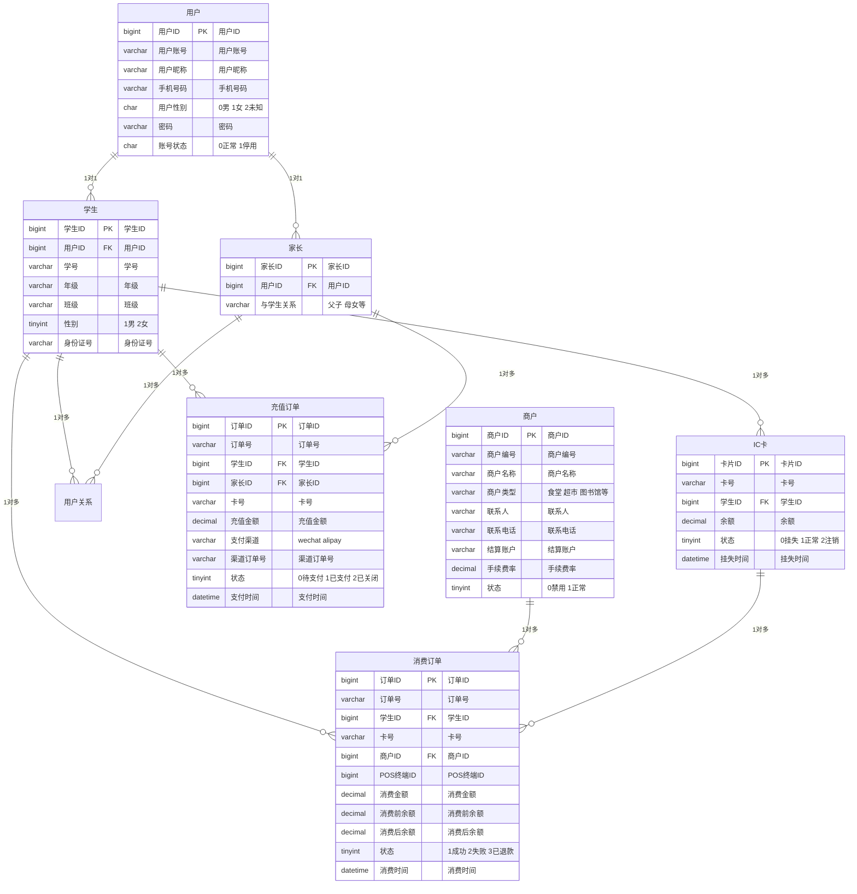

# 校园一卡通系统ER图 - 可视化图像

我已经为您创建了多种格式的ER图文件：

## 📊 已生成的文件

### 1. SVG格式（矢量图）
- **文件**: `校园一卡通ER图.svg`
- **特点**: 矢量图形，可无限放大不失真
- **用途**: 适合打印、高质量展示、进一步编辑

### 2. PNG格式生成方法

由于直接生成PNG需要额外的图像处理库，我为您提供了多种转换方案：

#### 🎯 方案一：使用在线转换（推荐）
1. 打开SVG文件
2. 访问 [SVG转PNG在线工具](https://svgtopng.com/)
3. 上传SVG文件，自动转换并下载PNG

#### 🎯 方案二：截图保存
1. 在浏览器中打开 `校园一卡通ER图.svg`
2. 调整浏览器窗口大小以获得最佳显示效果
3. 使用截图工具保存为PNG格式

#### 🎯 方案三：使用Mermaid在线工具
1. 访问 [Mermaid Live Editor](https://mermaid.live/)
2. 复制以下代码到编辑器：

3. 点击"Download PNG"按钮下载

## 🎨 图像特点

### 颜色方案
- **实体矩形**: #ffd4a3 (桃色) - 符合您提供的参考图片
- **关系菱形**: #a8e6cf (薄荷绿) - 标准ER图颜色
- **属性椭圆**: #a8d8ea (浅蓝) - 清晰的属性标识
- **连接线**: #666666 (灰色) - 清晰的关联显示

### 布局设计
- 用户实体组：左侧垂直排列
- 卡片实体：中间位置
- 商户实体：左下角
- 订单实体：底部水平排列
- 关系菱形：实体间居中位置

### 字体规范
- 实体名称：14px 粗体
- 属性名称：10px 常规
- 关系名称：10px 常规
- 基数标记：8px 小号

## 📋 使用建议

### 最佳实践
1. **SVG格式**：用于技术文档、网页展示、打印输出
2. **PNG格式**：用于PPT演示、报告文档、在线分享
3. **PDF格式**：用于正式文档、存档备份

### 文件管理
- 保留SVG源文件以便后续修改
- 生成多种分辨率PNG以适应不同用途
- 定期备份重要图表文件

您现在可以使用这些文件来满足不同的展示需求！如果您需要调整颜色、布局或添加更多实体，请告诉我。