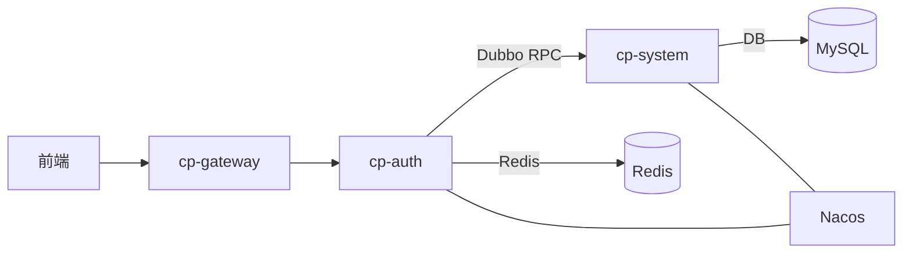
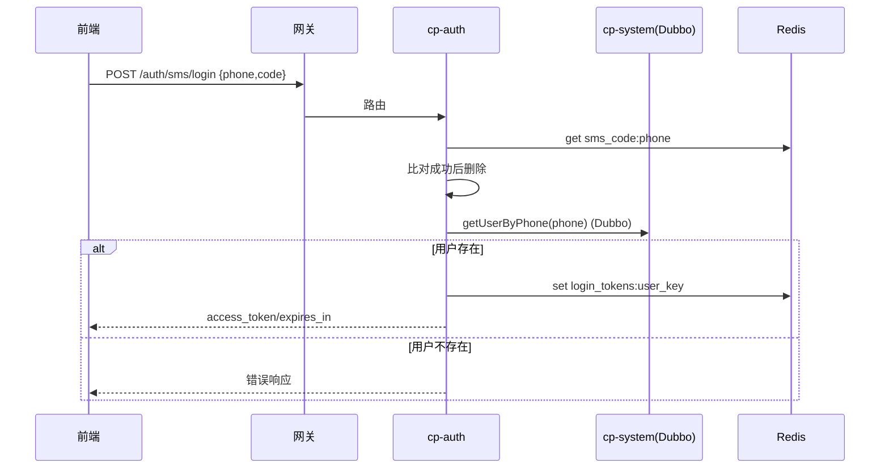

# Feign → Dubbo 迁移方案与数据流分析

## 可行性结论
- 认证链路可将 `cp-auth` 与 `cp-system` 的内部通信由 HTTP Feign 改为 Dubbo RPC。
- 网关与前端仍保留 HTTP，不影响外部调用与鉴权；Dubbo仅用于服务间内部调用。

## 改动范围
- 新增 Dubbo 依赖与配置（注册中心沿用 Nacos）。
- 在 `cp-api-system` 抽象出 RPC 接口（或复用现有接口签名），`cp-system` 提供 `@DubboService` 实现，`cp-auth` 通过 `@DubboReference` 引用。
- 原 Feign 接口保留一段时间作兼容，逐步替换调用点。

## 架构图


## 数据流图（短信登录为例）


## 迁移步骤
1. 依赖与配置
   - 在 `cp-auth`、`cp-system` 增加 Dubbo 依赖：
     - `org.apache.dubbo:dubbo-spring-boot-starter`
   - 在 `cp-system` 引入 MyBatis-Plus 简化常规数据库操作：
     - `com.baomidou:mybatis-plus-boot-starter`
   - 配置示例（application.yml）：
```yaml
dubbo:
  application:
    name: cp-auth
  registry:
    address: nacos://127.0.0.1:8848
  protocol:
    name: dubbo
    port: -1
```
2. 定义 RPC 接口（`cp-api-system`）
```java
package com.cp.system.api.rpc;

public interface UserRpcService {
  com.cp.common.core.domain.R<com.cp.system.api.model.LoginUser> getUserInfo(String username, String source);
  com.cp.common.core.domain.R<com.cp.system.api.model.LoginUser> getUserByPhone(String phone, String source);
  com.cp.common.core.domain.R<java.lang.Boolean> recordUserLogin(com.cp.system.api.domain.SysUser sysUser, String source);
}
```
3. `cp-system` 提供实现
```java
@org.apache.dubbo.config.annotation.DubboService(version = "1.0.0")
public class UserRpcServiceImpl implements com.cp.system.api.rpc.UserRpcService {
  @org.springframework.beans.factory.annotation.Autowired private com.cp.system.service.ISysUserService userService;
  @org.springframework.beans.factory.annotation.Autowired private com.cp.system.service.ISysPermissionService permissionService;
  public com.cp.common.core.domain.R<com.cp.system.api.model.LoginUser> getUserInfo(String username, String source){
    com.cp.system.api.domain.SysUser u = userService.selectUserByUserName(username);
    if(u==null){ return com.cp.common.core.domain.R.fail("用户名或密码错误"); }
    java.util.Set<String> roles = permissionService.getRolePermission(u);
    java.util.Set<String> perms = permissionService.getMenuPermission(u);
    com.cp.system.api.model.LoginUser vo = new com.cp.system.api.model.LoginUser();
    vo.setSysUser(u); vo.setRoles(roles); vo.setPermissions(perms);
    return com.cp.common.core.domain.R.ok(vo);
  }
  public com.cp.common.core.domain.R<com.cp.system.api.model.LoginUser> getUserByPhone(String phone, String source){
    com.cp.system.api.domain.SysUser u = userService.selectUserByPhone(phone);
    if(u==null){ return com.cp.common.core.domain.R.fail("用户不存在"); }
    java.util.Set<String> roles = permissionService.getRolePermission(u);
    java.util.Set<String> perms = permissionService.getMenuPermission(u);
    com.cp.system.api.model.LoginUser vo = new com.cp.system.api.model.LoginUser();
    vo.setSysUser(u); vo.setRoles(roles); vo.setPermissions(perms);
    return com.cp.common.core.domain.R.ok(vo);
  }
  public com.cp.common.core.domain.R<java.lang.Boolean> recordUserLogin(com.cp.system.api.domain.SysUser sysUser, String source){
    userService.updateUserLoginInfo(sysUser); // 需实现该更新方法
    return com.cp.common.core.domain.R.ok(java.lang.Boolean.TRUE);
  }
}
```

### 基于 MyBatis-Plus 的实现（推荐）
```java
@org.apache.dubbo.config.annotation.DubboService(version = "1.0.0")
public class UserRpcServiceImpl implements com.cp.system.api.rpc.UserRpcService {
  @org.springframework.beans.factory.annotation.Autowired private com.cp.system.service.ISysUserService userService;
  @org.springframework.beans.factory.annotation.Autowired private com.cp.system.service.ISysPermissionService permissionService;
  public com.cp.common.core.domain.R<com.cp.system.api.model.LoginUser> getUserInfo(String username, String source){
    com.cp.system.api.domain.SysUser u = userService.lambdaQuery()
      .eq(com.cp.system.api.domain.SysUser::getUserName, username)
      .one();
    if(u==null){ return com.cp.common.core.domain.R.fail("用户名或密码错误"); }
    java.util.Set<String> roles = permissionService.getRolePermission(u);
    java.util.Set<String> perms = permissionService.getMenuPermission(u);
    com.cp.system.api.model.LoginUser vo = new com.cp.system.api.model.LoginUser();
    vo.setSysUser(u); vo.setRoles(roles); vo.setPermissions(perms);
    return com.cp.common.core.domain.R.ok(vo);
  }
  public com.cp.common.core.domain.R<com.cp.system.api.model.LoginUser> getUserByPhone(String phone, String source){
    com.cp.system.api.domain.SysUser u = userService.lambdaQuery()
      .eq(com.cp.system.api.domain.SysUser::getPhonenumber, phone)
      .one();
    if(u==null){ return com.cp.common.core.domain.R.fail("用户不存在"); }
    java.util.Set<String> roles = permissionService.getRolePermission(u);
    java.util.Set<String> perms = permissionService.getMenuPermission(u);
    com.cp.system.api.model.LoginUser vo = new com.cp.system.api.model.LoginUser();
    vo.setSysUser(u); vo.setRoles(roles); vo.setPermissions(perms);
    return com.cp.common.core.domain.R.ok(vo);
  }
  public com.cp.common.core.domain.R<java.lang.Boolean> recordUserLogin(com.cp.system.api.domain.SysUser sysUser, String source){
    boolean ok = userService.lambdaUpdate()
      .eq(com.cp.system.api.domain.SysUser::getUserId, sysUser.getUserId())
      .set(com.cp.system.api.domain.SysUser::getLoginIp, sysUser.getLoginIp())
      .set(com.cp.system.api.domain.SysUser::getLoginDate, java.time.LocalDateTime.now())
      .update();
    return ok ? com.cp.common.core.domain.R.ok(java.lang.Boolean.TRUE)
              : com.cp.common.core.domain.R.fail("更新登录信息失败");
  }
}
```

#### 服务层接口定义（MyBatis-Plus）
```java
public interface ISysUserService extends com.baomidou.mybatisplus.extension.service.IService<com.cp.system.api.domain.SysUser> {}
```
4. `cp-auth` 引用并替换调用
```java
@org.apache.dubbo.config.annotation.DubboReference(version = "1.0.0", check = false, timeout = 3000, retries = 0)
private com.cp.system.api.rpc.UserRpcService userRpcService;

com.cp.common.core.domain.R<com.cp.system.api.model.LoginUser> r = userRpcService.getUserByPhone(phone, com.cp.common.core.constant.SecurityConstants.INNER);
if (r.getCode() == com.cp.common.core.domain.R.FAIL) { throw new com.cp.common.core.exception.ServiceException(r.getMsg()); }
com.cp.system.api.model.LoginUser loginUser = r.getData();
return tokenService.createToken(loginUser);
```

## 安全与上下文传递
- Feign 的内部来源头 `from-source=inner` 需改为 Dubbo 附件传递（可选）：
```java
org.apache.dubbo.rpc.RpcContext.getClientAttachment().setAttachment("from-source", com.cp.common.core.constant.SecurityConstants.INNER);
```
- 网关与 JWT 流程不变，Dubbo仅替换服务间调用层。

## 配置要点
- 注册中心使用 `nacos://` 地址；确保 `cp-auth` 与 `cp-system` 均注册到同一 Nacos。
- 超时与重试：建议 `timeout=3000ms`，`retries=0`（认证链路宜幂等、避免重复写会话）。
- 序列化：保持默认 hessian2 或选择 kryo；与对象兼容性一致。
- 数据访问：`cp-system` 推荐使用 MyBatis-Plus 完成查询与更新，减少样板代码，提高开发效率。

## 回滚方案
- 保留 Feign 接口与实现，在 `@DubboReference` 引用失败时回退到 Feign 调用（可通过策略类封装）。
- 灰度切换：先在 `sms/login` 路径使用 Dubbo，其余登录路径仍用 Feign，验证稳定后再全部切换。

## 测试建议
- 连通性：`cp-auth` 启动后在 Nacos 看到 `cp-system` Provider；`@DubboReference` 注入成功。
- 功能：短信登录与账号密码登录均返回令牌；Redis 会话写入正常；网关鉴权通过。
- 异常：Provider 下线、超时、异常返回时认证服务正确失败并不重复调用。