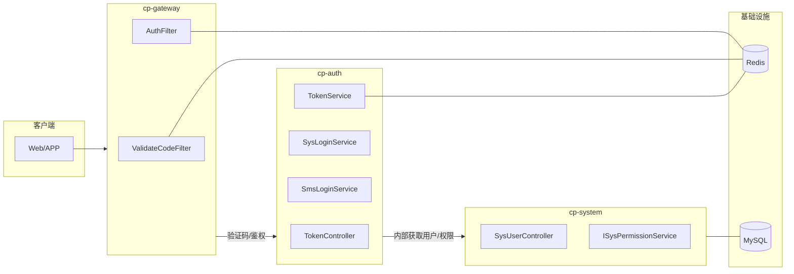
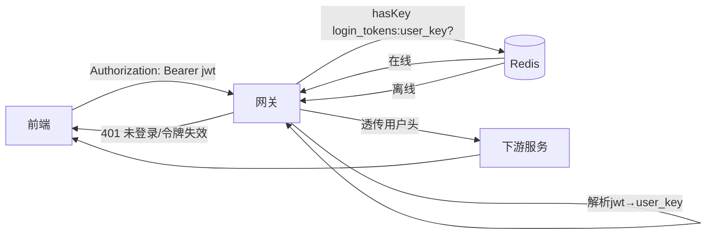

# 安全框架服务实现与数据流分析

## 概述
- 项目采用基于 Spring Cloud + Spring Security 的轻量安全框架：网关统一鉴权、认证服务颁发令牌、Redis 维护会话、下游服务基于透传头进行权限判断。
- 安全边界由网关把控，令牌与会话统一由认证服务生成，系统服务负责用户与权限数据。

## 核心组件
- 令牌与会话
  - `TokenService` 负责创建令牌、刷新与删除会话，写入 Redis。
  - 创建令牌：`cp-common/cp-common-security/src/main/java/com/cp/common/security/service/TokenService.java:48-69`
  - 刷新会话：`cp-common/cp-common-security/src/main/java/com/cp/common/security/service/TokenService.java:161-168`
- 网关鉴权过滤器
  - `AuthFilter` 解析前端 `JWT`，校验 Redis 会话在线，注入用户头后转发下游。
  - 校验在线：`cp-gateway/src/main/java/com/cp/gateway/filter/AuthFilter.java:64-69`
  - 注入用户头：`cp-gateway/src/main/java/com/cp/gateway/filter/AuthFilter.java:77-83`
- 前置验证码过滤器
  - `ValidateCodeFilter` 在登录/注册路径对图形验证码进行校验（生成写入 Redis，登录前校验）。
- 用户与权限
  - `SysUserController` 提供内部接口返回 `LoginUser`（包含 `SysUser`、角色与菜单权限）。`cp-modules/cp-system/src/main/java/com/cp/system/controller/SysUserController.java:55-66`
  - 角色与权限由 `ISysPermissionService` 计算并注入到返回的 `LoginUser`。
- 常量与配置
  - 会话过期与键前缀：`cp-common/cp-common-core/src/main/java/com/cp/common/core/constant/CacheConstants.java:13,18,33`
  - 安全头与载荷字段：`cp-common/cp-common-core/src/main/java/com/cp/common/core/constant/SecurityConstants.java:13,18,38`

## 权限模型
- 用户 → 角色 → 菜单/权限 标准 RBAC：
  - 登录后获取 `LoginUser.roles` 与 `LoginUser.permissions`（菜单/按钮权限字符串）
  - 下游服务基于透传的用户信息加载当前会话的权限集合进行判定（与 RuoYi Cloud 模式一致）。

## 认证数据流
### 账号密码登录
1. 前端 `POST /auth/login {username,password,uuid,code}`
2. 网关 `ValidateCodeFilter` 校验 `captcha_codes:<uuid>` 成功后路由到认证服务
3. 认证服务 `SysLoginService#login`：查询用户、校验状态、密码错误次数与锁定、记录登录日志（远程系统服务）
4. 调用 `TokenService#createToken` 生成 `JWT` 与 `user_key`，写入 `login_tokens:<user_key>`（TTL = `EXPIRATION` 分钟）
5. 返回 `R.ok({ access_token, expires_in })`

### 短信验证码登录
1. 发送验证码 `POST /auth/sms/send {phone}`：生成 6 位验证码，写入 `sms_code:<phone>`（5 分钟），防刷键 `sms_lock:<phone>`、当日次数 `sms_count:<phone>:<date>`
2. 登录 `POST /auth/sms/login {phone,code}`：比对 `sms_code:<phone>`，删除验证码；内部查询用户；若存在则创建令牌与会话，返回令牌；若不存在返回错误

### 网关鉴权
- 下游接口访问时，前端携带 `Authorization: Bearer <jwt>`
- 网关解析 `jwt` 拿到 `user_key`，`Redis.hasKey("login_tokens:"+user_key)` 校验在线
- 在线则注入 `user_key/user_id/username` 到请求头，删除内部来源头后转发；否则返回未登录/令牌失效

## Redis 键与过期策略
- `login_tokens:<user_key>`：会话对象 `LoginUser`，TTL `EXPIRATION` 分钟（默认 720）
- `captcha_codes:<uuid>`：图形验证码（网关）
- `sms_code:<phone>`、`sms_lock:<phone>`、`sms_count:<phone>:<date>`：短信登录风控与验证码维护
- `pwd_err_cnt:<username>`：密码错误计数与锁定策略

## 架构图


## 数据流图
### 账号密码登录
```mermaid
flowchart LR
  FE[前端] -->|POST /auth/login| GW[网关]
  GW -->|校验 captcha_codes:uuid| R[(Redis)]
  GW --> AU[cp-auth]
  AU -->|用户/状态/密码校验| SY[cp-system]
  AU --> TS[TokenService]
  TS -->|set login_tokens:user_key TTL 720m| R
  AU -->|R.ok {access_token,expires_in}| FE
```

### 短信验证码登录
```mermaid
flowchart LR
  FE[前端] -->|POST /auth/sms/send {phone}| GW[网关]
  GW --> AU[cp-auth]
  AU -->|频率校验/生成验证码| AU
  AU -->|sms_code/sms_lock/sms_count| R[(Redis)]
  AU -->|R.ok| FE

  FE -->|POST /auth/sms/login {phone,code}| GW
  GW --> AU
  AU -->|get/compare sms_code; delete| R
  AU -->|getUserByPhone(phone)| SY[cp-system]
  AU --> TS[TokenService]
  TS -->|set login_tokens:user_key| R
  AU -->|R.ok {access_token,expires_in}| FE
```

### 网关鉴权


## 关键代码位置
- 令牌与会话：`cp-common/cp-common-security/src/main/java/com/cp/common/security/service/TokenService.java:48-69,161-168`
- 网关鉴权：`cp-gateway/src/main/java/com/cp/gateway/filter/AuthFilter.java:64-69,77-83`
- 登录服务：`cp-auth/src/main/java/com/cp/auth/service/SysLoginService.java:45`、`cp-auth/src/main/java/com/cp/auth/service/SmsLoginService.java:99-133`
- 用户信息接口：`cp-modules/cp-system/src/main/java/com/cp/system/controller/SysUserController.java:55-66,69-84`
- 常量：`cp-common/cp-common-core/src/main/java/com/cp/common/core/constant/CacheConstants.java:13,18,33`、`SecurityConstants.java:13,18,38`

## 测试建议
- 开发模式启动：`-Dspring.profiles.active=dev -Dsms.mock.enabled=true`
- 用例覆盖：
  - 验证码通过/失败、密码错误计数与锁定、短信频率限制、用户不存在、令牌过期与网关鉴权失败。