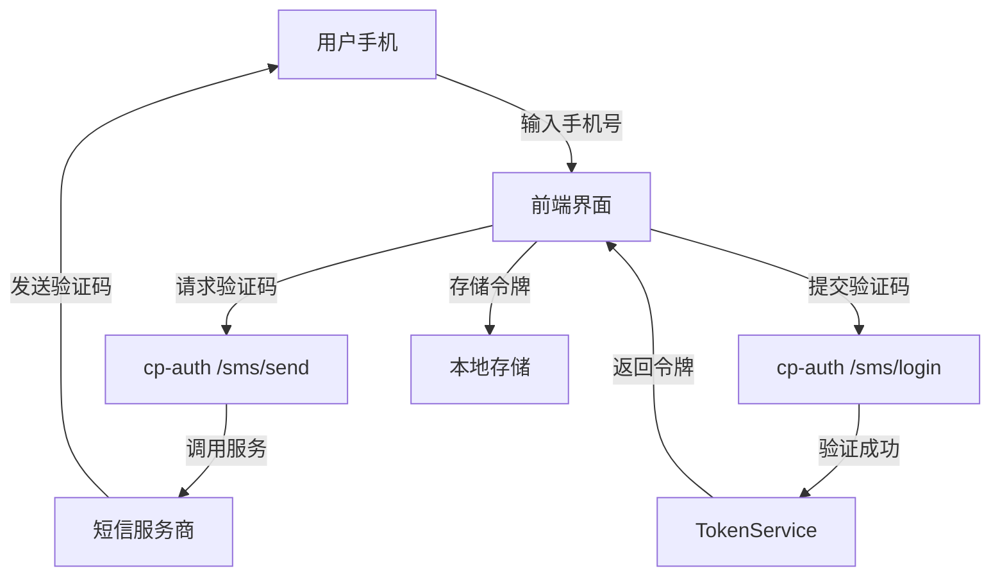
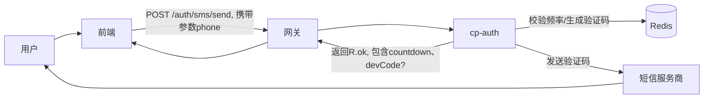
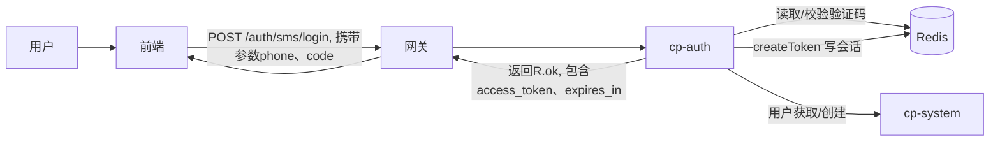
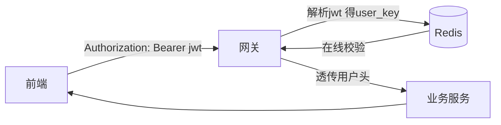

# 手机验证码登录实现流程文档（Java版）

## 📱 系统架构概览



## 🔧 环境配置

### 1. 后端工程
- 模块：`cp-auth`、`cp-gateway`、`cp-modules/cp-system`、`cp-common/*`
- JDK：17 或 11
- 构建：Maven

### 2. 依赖
`cp-auth/pom.xml` 增加：
```xml
<dependencies>
  <dependency>
    <groupId>com.aliyun</groupId>
    <artifactId>aliyun-java-sdk-dysmsapi</artifactId>
    <version>2.2.1</version>
  </dependency>
  <dependency>
    <groupId>com.aliyun</groupId>
    <artifactId>aliyun-java-sdk-core</artifactId>
    <version>4.5.22</version>
  </dependency>
</dependencies>
```

### 3. 配置
`cp-auth/src/main/resources/application.yml`：
```yaml
sms:
  code:
    expire-seconds: 300
    daily-limit: 5
    resend-interval-seconds: 60
aliyun:
  sms:
    region-id: cn-hangzhou
    access-key-id: ${ALIYUN_ACCESS_KEY_ID}
    access-key-secret: ${ALIYUN_ACCESS_KEY_SECRET}
    sign-name: 你的短信签名
    template-code: SMS_123456789
```

## 🚀 后端实现（cp-auth）

### 1. 请求模型
```java
package com.cp.auth.domain;
import javax.validation.constraints.NotBlank;
import javax.validation.constraints.Pattern;
public class SmsSendBody {
  @NotBlank
  @Pattern(regexp = "^1[3-9]\\d{9}$")
  private String phone;
  public String getPhone() { return phone; }
  public void setPhone(String phone) { this.phone = phone; }
}
```

```java
package com.cp.auth.domain;
import javax.validation.constraints.NotBlank;
import javax.validation.constraints.Pattern;
public class SmsLoginBody {
  @NotBlank
  @Pattern(regexp = "^1[3-9]\\d{9}$")
  private String phone;
  @NotBlank
  @Pattern(regexp = "^\\d{6}$")
  private String code;
  public String getPhone() { return phone; }
  public void setPhone(String phone) { this.phone = phone; }
  public String getCode() { return code; }
  public void setCode(String code) { this.code = code; }
}
```

### 2. 控制器
```java
package com.cp.auth.controller;
import com.cp.common.core.domain.R;
import com.cp.auth.domain.SmsSendBody;
import com.cp.auth.domain.SmsLoginBody;
import com.cp.auth.service.SmsLoginService;
import org.springframework.validation.annotation.Validated;
import org.springframework.web.bind.annotation.*;
import javax.annotation.Resource;
import java.util.Map;

@RestController
@RequestMapping("/sms")
public class SmsTokenController {
  @Resource
  private SmsLoginService smsLoginService;

  @PostMapping("/send")
  public R<Void> send(@Validated @RequestBody SmsSendBody body) {
    smsLoginService.sendCode(body.getPhone());
    return R.ok();
  }

  @PostMapping("/login")
  public R<Map<String, Object>> login(@Validated @RequestBody SmsLoginBody body) {
    Map<String, Object> token = smsLoginService.login(body.getPhone(), body.getCode());
    return R.ok(token);
  }
}
```

### 3. 服务（cp-auth）
```java
package com.cp.auth.service;
import com.cp.common.redis.service.RedisService;
import com.cp.common.core.exception.ServiceException;
import com.cp.common.core.utils.StringUtils;
import com.cp.common.security.service.TokenService;
import com.cp.common.core.constant.SecurityConstants;
import com.cp.common.core.domain.R;
import com.cp.system.api.RemoteUserService;
import com.cp.system.api.model.LoginUser;
import com.cp.system.api.domain.SysUser;
import org.springframework.beans.factory.annotation.Value;
import org.springframework.stereotype.Service;
import javax.annotation.Resource;
import java.time.Duration;
import java.time.LocalDate;
import java.util.Map;
import java.util.Random;

@Service
public class SmsLoginService {
  @Resource
  private RedisService redisService;
  @Resource
  private SmsSender smsSender;
  @Resource
  private RemoteUserService remoteUserService;
  @Resource
  private TokenService tokenService;
  @Value("${sms.code.expire-seconds:300}")
  private long expireSeconds;
  @Value("${sms.code.daily-limit:5}")
  private int dailyLimit;
  @Value("${sms.code.resend-interval-seconds:60}")
  private long resendInterval;

  public void sendCode(String phone) {
    String lockKey = "sms_lock:" + phone;
    String last = redisService.getCacheObject(lockKey);
    if (StringUtils.isNotEmpty(last)) throw new ServiceException("发送太频繁");
    String countKey = "sms_count:" + phone + ":" + LocalDate.now();
    Integer cnt = StringUtils.toInteger(redisService.getCacheObject(countKey));
    if (cnt != null && cnt >= dailyLimit) throw new ServiceException("今日次数已达上限");
    String code = String.format("%06d", new Random().nextInt(1000000));
    smsSender.send(phone, code);
    redisService.setCacheObject("sms_code:" + phone, code, expireSeconds, java.util.concurrent.TimeUnit.SECONDS);
    redisService.setCacheObject(lockKey, "1", resendInterval, java.util.concurrent.TimeUnit.SECONDS);
    redisService.setCacheObject(countKey, String.valueOf((cnt == null ? 0 : cnt) + 1), 1L, java.util.concurrent.TimeUnit.DAYS);
  }

  public Map<String, Object> login(String phone, String code) {
    String cached = redisService.getCacheObject("sms_code:" + phone);
    if (!StringUtils.equals(code, cached)) throw new ServiceException("验证码错误或已过期");
    redisService.deleteObject("sms_code:" + phone);
    R<LoginUser> userResult = remoteUserService.getUserByPhone(phone, SecurityConstants.INNER);
    LoginUser loginUser;
    if (userResult.getCode() == R.FAIL) {
      SysUser nu = new SysUser();
      nu.setUserName(phone);
      nu.setNickName(phone);
      nu.setPhonenumber(phone);
      nu.setStatus("0");
      remoteUserService.registerUserInfo(nu, SecurityConstants.INNER);
      loginUser = remoteUserService.getUserByPhone(phone, SecurityConstants.INNER).getData();
    } else {
      loginUser = userResult.getData();
    }
    return tokenService.createToken(loginUser);
  }
}
```

### 4. 发送器与条件装配
```java
package com.cp.auth.service;
import com.aliyuncs.profile.DefaultProfile;
import com.aliyuncs.DefaultAcsClient;
import com.aliyuncs.dysmsapi.model.v20170525.SendSmsRequest;
import com.aliyuncs.dysmsapi.model.v20170525.SendSmsResponse;
import org.springframework.beans.factory.annotation.Value;
import org.springframework.stereotype.Component;
import org.springframework.boot.autoconfigure.condition.ConditionalOnProperty;

@Component
@ConditionalOnProperty(prefix = "sms.mock", name = "enabled", havingValue = "false", matchIfMissing = true)
public class AliyunSmsSender implements SmsSender {
  @Value("${aliyun.sms.region-id}")
  private String regionId;
  @Value("${aliyun.sms.access-key-id}")
  private String accessKeyId;
  @Value("${aliyun.sms.access-key-secret}")
  private String accessKeySecret;
  @Value("${aliyun.sms.sign-name}")
  private String signName;
  @Value("${aliyun.sms.template-code}")
  private String templateCode;

  @Override
  public void send(String phone, String code) {
    DefaultProfile profile = DefaultProfile.getProfile(regionId, accessKeyId, accessKeySecret);
    DefaultAcsClient client = new DefaultAcsClient(profile);
    SendSmsRequest request = new SendSmsRequest();
    request.setPhoneNumbers(phone);
    request.setSignName(signName);
    request.setTemplateCode(templateCode);
    request.setTemplateParam("{\"code\":\"" + code + "\"}");
    SendSmsResponse response = client.getAcsResponse(request);
    if (response == null || !"OK".equalsIgnoreCase(response.getCode())) {
      throw new RuntimeException("短信发送失败");
    }
  }
}
```

## 🌐 前端对接

### 1. 接口
```js
export function sendSmsCode(phone) {
  return request({ url: '/auth/sms/send', method: 'post', data: { phone } })
}
export function smsLogin(phone, code) {
  return request({ url: '/auth/sms/login', method: 'post', data: { phone, code } })
}
```

### 2. 页面要点
- 手机号输入校验 `^1[3-9]\d{9}$`
- 倒计时禁用二次发送
- 登录成功后保存 `access_token`

## 🔐 安全与限流
- 验证码5分钟有效
- 60秒内不可重发
- 每日5次限制
- 使用 `TokenService` 发放令牌，与现有会话一致

## 🧪 验证与部署
- 本地启动 `cp-auth` 与 Redis 后测试接口
- 网关转发路径 `/auth/**`，在前端统一走网关域名

## 📦 依赖与配置清单
- `cp-common-redis` 的 `RedisService`
- `cp-common-security` 的 `TokenService`
- `cp-api-system` 的 `RemoteUserService`

## ✅ 交付
- 新增 `cp-auth` 两个端点：`POST /sms/send`、`POST /sms/login`
- 与现有登录态和网关鉴权兼容

## 🧭 开发阶段零费用备用方案（主流程不变）

### 1. 目标
- 不调用第三方短信通道、不产生费用
- 仍保持“发送验证码 → 校验验证码 → 发令牌”的主流程与接口不变
- 仅在开发/测试环境启用，生产环境禁用

### 2. 开关与配置
`cp-auth/src/main/resources/application-dev.yml`：
```yaml
sms:
  mock:
    enabled: true
    master-code: 000000
    whitelist:
      - 13800138000
      - 13900139001
  code:
    expire-seconds: 300
    daily-limit: 100
    resend-interval-seconds: 2
```

含义：
- `enabled`：开启模拟短信通道
- `master-code`：开发万能码，配合白名单手机号使用
- `whitelist`：允许使用万能码的测试手机号
- 其他参数与正式环境一致，但可放宽频率方便测试

### 3. 设计与实现

#### 3.1 发送器接口
```java
package com.cp.auth.service;
public interface SmsSender {
  void send(String phone, String code);
}
```

#### 3.2 模拟发送器（零费用）
```java
package com.cp.auth.service;
import org.springframework.beans.factory.annotation.Value;
import org.springframework.boot.autoconfigure.condition.ConditionalOnProperty;
import org.springframework.stereotype.Component;
import org.slf4j.Logger; import org.slf4j.LoggerFactory;

@Component
@ConditionalOnProperty(prefix = "sms.mock", name = "enabled", havingValue = "true")
public class MockSmsSender implements SmsSender {
  private static final Logger log = LoggerFactory.getLogger(MockSmsSender.class);
  @Value("${sms.mock.enabled:false}") private boolean mockEnabled;
  @Override
  public void send(String phone, String code) {
    if (mockEnabled) {
      log.info("[DEV MOCK SMS] phone={} code={}", phone, code);
    }
  }
}
```

#### 3.3 正式发送器条件化
```java
@Component
@ConditionalOnProperty(prefix = "sms.mock", name = "enabled", havingValue = "false", matchIfMissing = true)
public class AliyunSmsSender implements SmsSender { /* 同上实现 */ }
```

#### 3.4 服务层兼容万能码
```java
@Value("${sms.mock.master-code:}")
private String masterCode;
@Value("${sms.mock.whitelist:}")
private java.util.List<String> whitelist;

public Map<String, Object> login(String phone, String code) {
  String cached = redisService.getCacheObject("sms_code:" + phone);
  boolean masterOk = org.apache.commons.lang3.StringUtils.isNotBlank(masterCode)
      && masterCode.equals(code) && whitelist != null && whitelist.contains(phone);
  if (!(org.apache.commons.lang3.StringUtils.equals(code, cached) || masterOk)) {
    throw new ServiceException("验证码错误或已过期");
  }
  if (!masterOk) { redisService.deleteObject("sms_code:" + phone); }
  /* 后续与正式逻辑一致：用户获取/创建、令牌生成 */
  /* ... */
  return tokenService.createToken(loginUser);
}
```

#### 3.5 控制器在开发模式下回传 devCode（可选）
```java
@Value("${sms.mock.enabled:false}")
private boolean mockEnabled;

@PostMapping("/send")
public R<java.util.Map<String,Object>> send(@Validated @RequestBody SmsSendBody body) {
  smsLoginService.sendCode(body.getPhone());
  java.util.Map<String,Object> resp = new java.util.HashMap<>();
  resp.put("countdown", 60);
  if (mockEnabled) {
    String code = redisService.getCacheObject("sms_code:" + body.getPhone());
    resp.put("devCode", code);
  }
  return R.ok(resp);
}
```

### 4. 前端对接保持不变
- 仍然调用 `POST /auth/sms/send` 与 `POST /auth/sms/login`
- 开发环境可显示 `devCode` 以便手工输入；生产环境无此字段

### 5. 安全与切换
- 模拟通道仅在 `dev` 或测试环境开启
- 生产环境确保 `sms.mock.enabled=false`
- 万能码仅对白名单手机号生效，避免误用
- 发送日志仅输出到本地日志，禁止外泄

### 6. 验证步骤
- 启动 `cp-auth`（`spring.profiles.active=dev`）
- 调用 `/sms/send`，收到 `devCode`
- 用 `devCode` 或白名单 `master-code` 调用 `/sms/login`，拿到 `access_token`

### 7. 费用对比
- 正式：按短信服务商计费
- 开发：不调用外部短信，无费用

## 📈 数据流图

### 1. 发送验证码（/auth/sms/send）


### 2. 验证码登录（/auth/sms/login）


### 3. 令牌后的业务访问

### 5. 开发环境配置（零费用）
```yaml
# cp-auth/src/main/resources/application-dev.yml
sms:
  mock:
    enabled: true
    master-code: 000000
    whitelist:
      - 13800138000
      - 13900139001
  code:
    expire-seconds: 300
    daily-limit: 100
    resend-interval-seconds: 2

aliyun:
  sms:
    region-id: cn-hangzhou
    access-key-id: ${ALIYUN_ACCESS_KEY_ID:}
    access-key-secret: ${ALIYUN_ACCESS_KEY_SECRET:}
    sign-name: 你的短信签名
    template-code: SMS_123456789
```

### 6. 系统服务接口（cp-system）
```java
// cp-api-system: RemoteUserService 增加
@GetMapping("/user/phone/{phone}")
public R<LoginUser> getUserByPhone(@PathVariable("phone") String phone, @RequestHeader(SecurityConstants.FROM_SOURCE) String source);

// cp-system: SysUserController 增加
@InnerAuth
@GetMapping("/phone/{phone}")
public R<LoginUser> phone(@PathVariable("phone") String phone) {
    SysUser sysUser = userService.selectUserByPhone(phone);
    if (StringUtils.isNull(sysUser)) {
        return R.fail("用户不存在");
    }
    Set<String> roles = permissionService.getRolePermission(sysUser);
    Set<String> permissions = permissionService.getMenuPermission(sysUser);
    LoginUser vo = new LoginUser();
    vo.setSysUser(sysUser);
    vo.setRoles(roles);
    vo.setPermissions(permissions);
    return R.ok(vo);
}
```

### 7. 实现步骤更新
- 发送验证码：前端调用 `/auth/sms/send` → `cp-auth` 通过 `SmsSender`（Mock/阿里云）发送 → 验证码写入 `Redis` 键 `sms_code:<phone>`，频率键 `sms_lock:<phone>`、计数键 `sms_count:<phone>:<date>`
- 验证码登录：前端调用 `/auth/sms/login` → `cp-auth` 校验验证码 → 通过 `RemoteUserService.getUserByPhone` 获取用户，若不存在则返回错误 → 使用 `TokenService.createToken(LoginUser)` 创建令牌与会话 `login_tokens:<user_key>` → 返回 `access_token/expires_in`
- 开发环境：`sms.mock.enabled=true` 时启用 `MockSmsSender`，支持白名单手机号使用 `master-code`，不调用外部短信，主流程不变