# 校园一卡通系统数据库设计文档

## 1. 系统概述

本系统是一个校园一卡通管理系统，包含用户管理、学生管理、商户管理、充值消费、权限管理等功能模块。

## 2. 数据库表结构

### 2.1 用户相关表

#### 2.1.1 用户信息表 (sys_user)

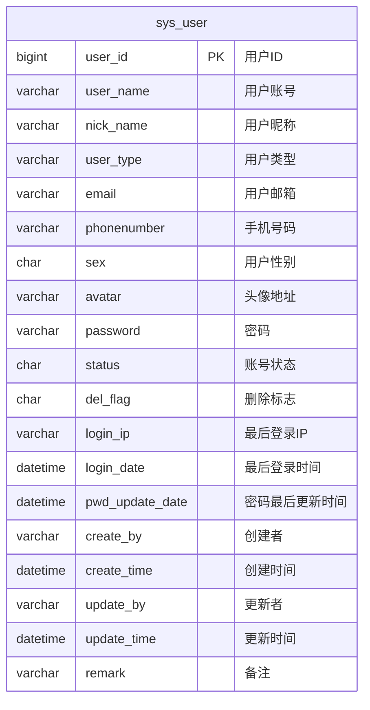

#### 2.1.2 学生表 (student)

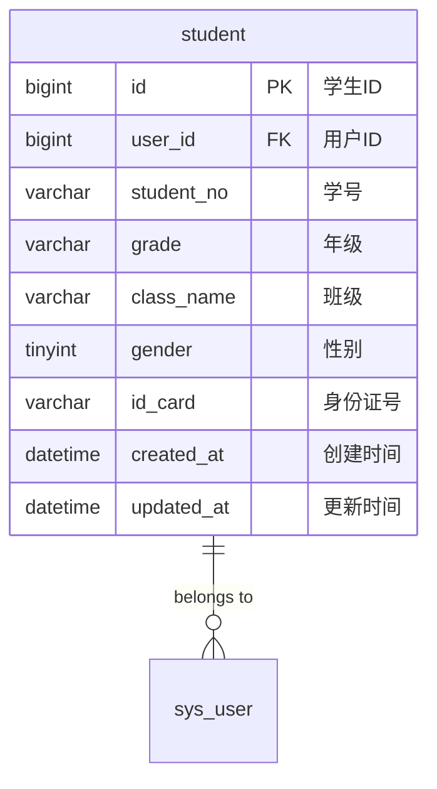

#### 2.1.3 家长表 (parent)

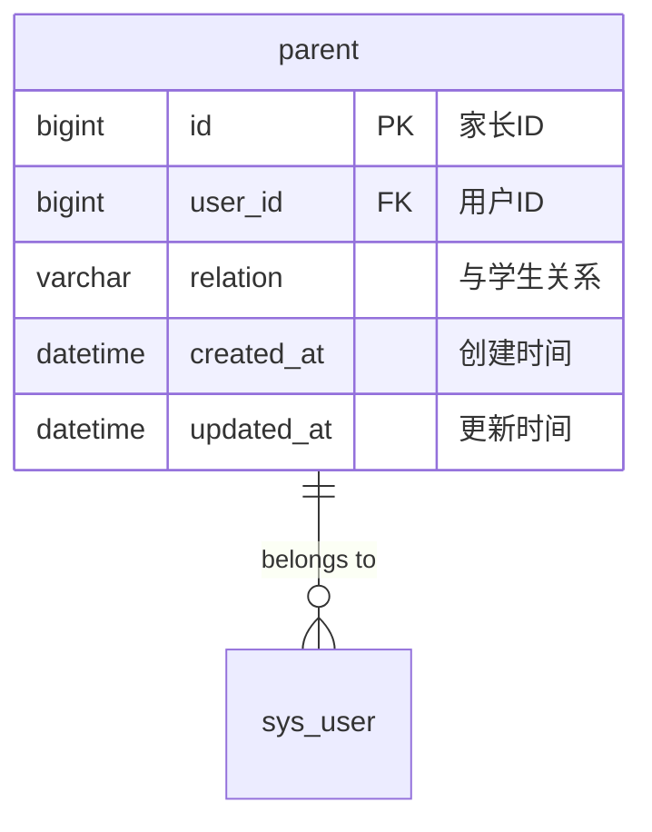

#### 2.1.4 用户关系表 (user_relation)

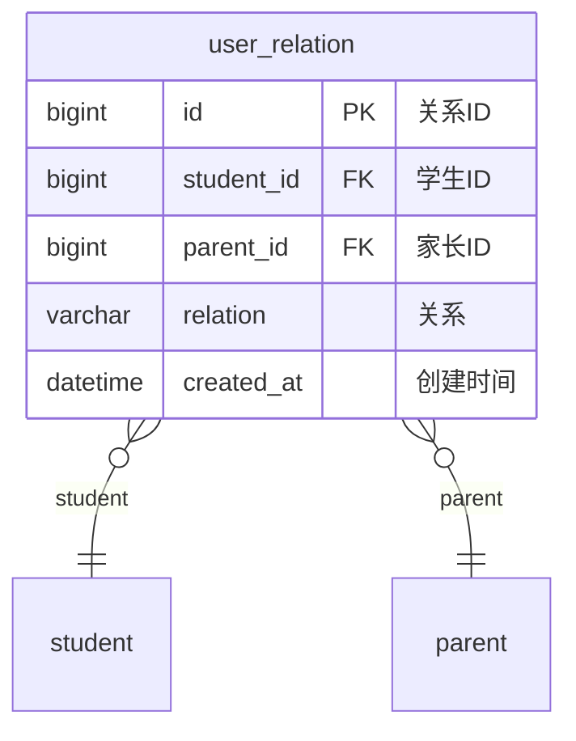

### 2.2 卡片相关表

#### 2.2.1 IC卡表 (ic_card)

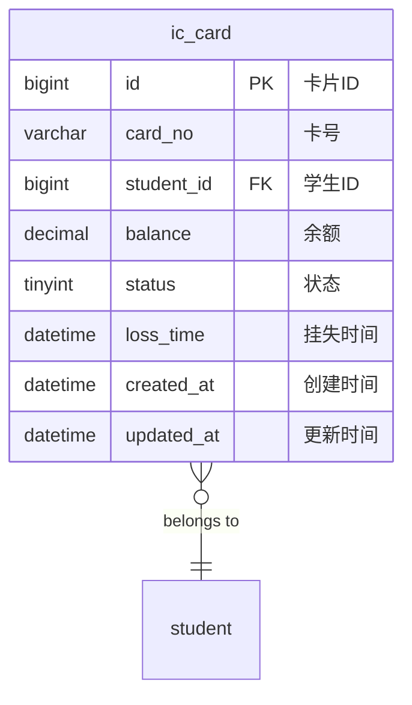

### 2.3 商户相关表

#### 2.3.1 商户表 (merchant)

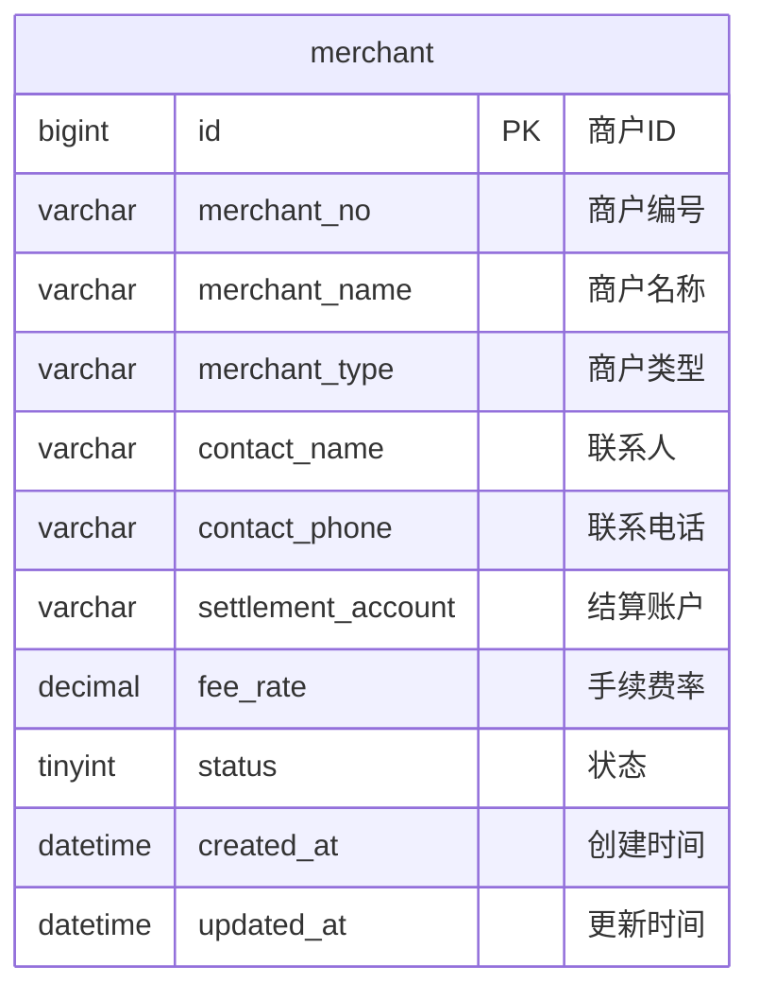

### 2.4 订单相关表

#### 2.4.1 充值订单表 (recharge_order)

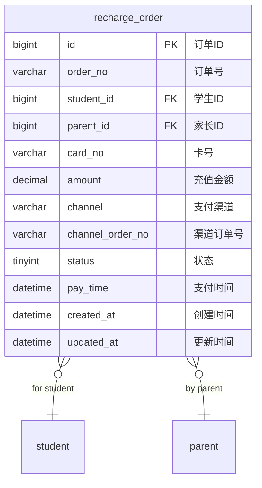

#### 2.4.2 消费订单表 (consume_order)

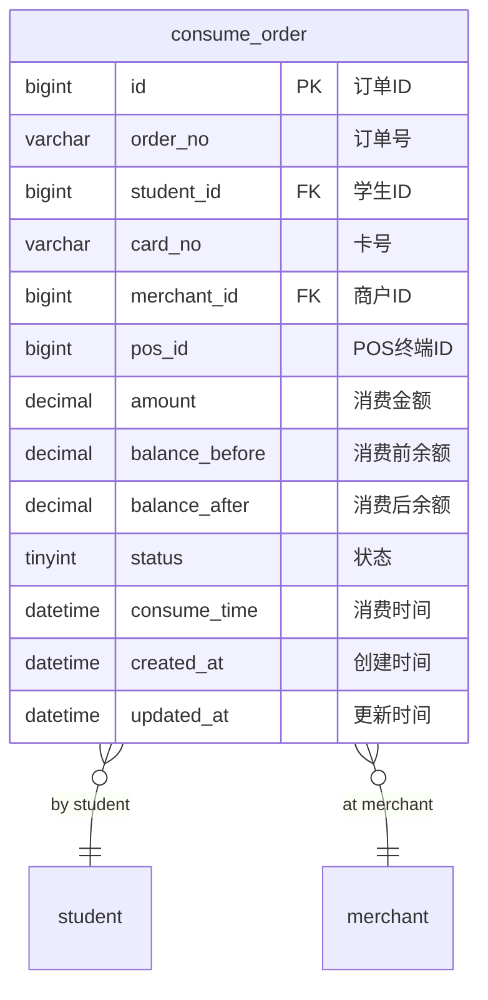

### 2.5 系统管理表

#### 2.5.1 角色表 (sys_role)

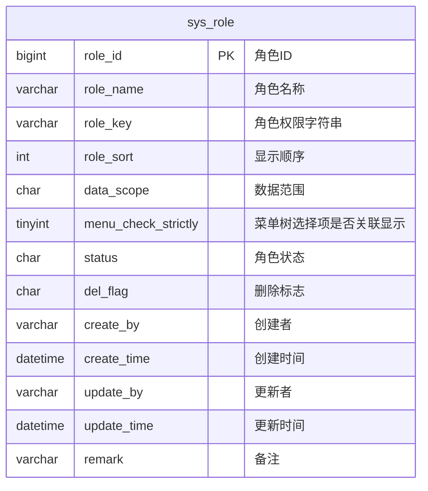

#### 2.5.2 菜单表 (sys_menu)

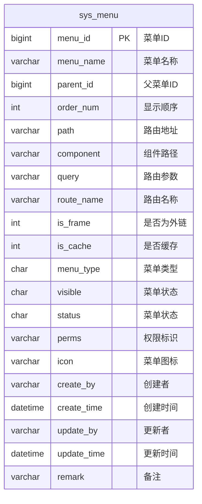

#### 2.5.3 角色菜单关联表 (sys_role_menu)

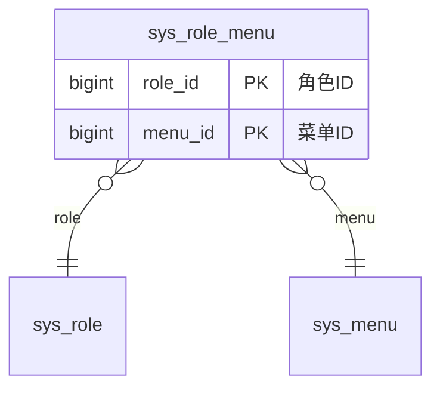

#### 2.5.4 字典类型表 (sys_dict_type)

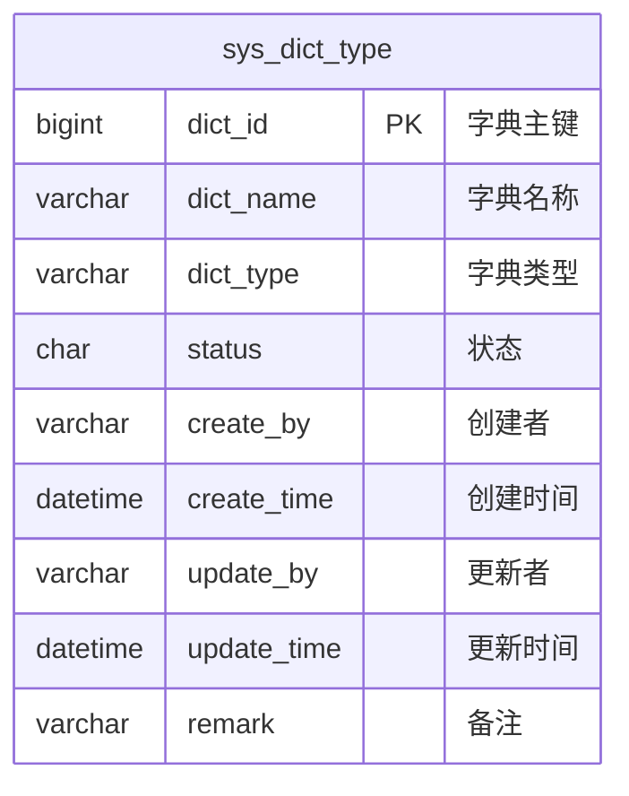

#### 2.5.5 字典数据表 (sys_dict_data)

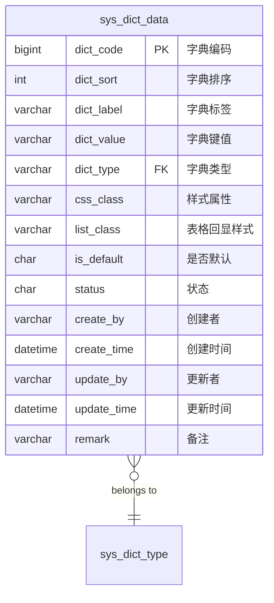

### 2.6 系统日志表

#### 2.6.1 操作日志表 (sys_oper_log)

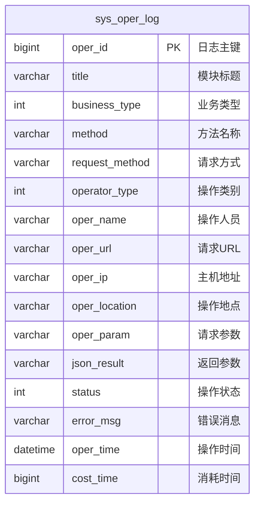

#### 2.6.2 登录日志表 (sys_logininfor)

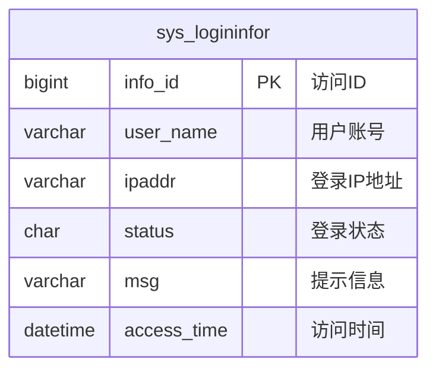

#### 2.6.3 通知公告表 (sys_notice)

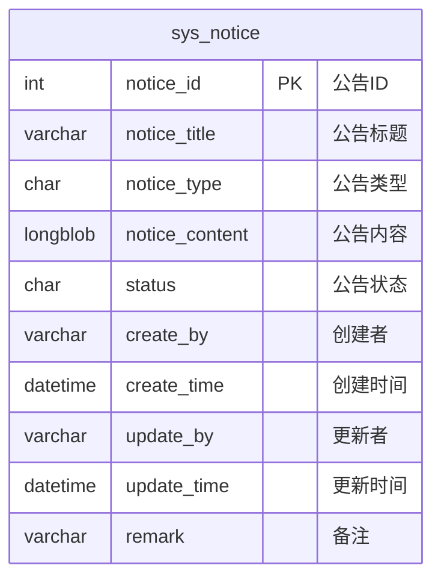

## 3. 整体ER图

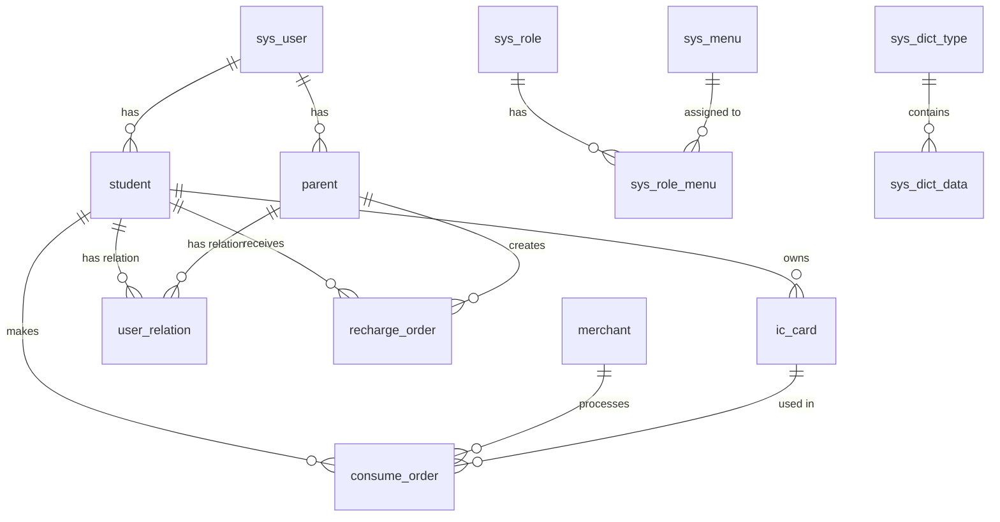

## 4. 表关系说明

### 4.1 主要关系

1. **用户-学生关系**：一个用户对应一个学生（一对一）
2. **用户-家长关系**：一个用户对应一个家长（一对一）
3. **学生-IC卡关系**：一个学生可以有多张IC卡（一对多）
4. **学生-家长关系**：通过user_relation表建立多对多关系
5. **充值订单关系**：涉及学生、家长和IC卡三方
6. **消费订单关系**：涉及学生、商户和IC卡三方

### 4.2 系统管理关系

1. **角色-菜单关系**：通过sys_role_menu表建立多对多关系
2. **字典类型-字典数据关系**：一个字典类型包含多个字典数据（一对多）

## 5. 数据字典

### 5.1 用户性别
- 0：男
- 1：女
- 2：未知

### 5.2 账号状态
- 0：正常
- 1：停用

### 5.3 删除标志
- 0：存在
- 2：删除

### 5.4 通知类型
- 1：通知
- 2：公告

### 5.5 订单状态
- 充值订单：0-待支付，1-已支付，2-已关闭
- 消费订单：1-成功，2-失败，3-已退款

### 5.6 IC卡状态
- 0：挂失
- 1：正常
- 2：注销

## 6. 索引设计

### 6.1 主要索引

1. **用户表**：用户账号唯一索引
2. **学生表**：学号唯一索引，班级组合索引
3. **IC卡表**：卡号唯一索引，学生ID索引
4. **商户表**：商户编号唯一索引，商户类型索引
5. **订单表**：订单号唯一索引，相关ID索引

### 6.2 性能优化

1. 经常查询的字段建立索引
2. 外键字段建立索引
3. 时间字段建立索引便于时间范围查询
4. 状态字段建立索引便于状态筛选