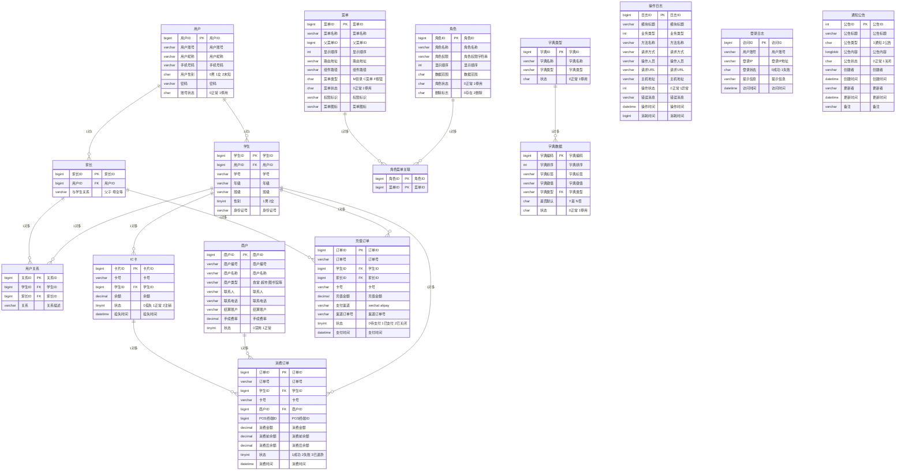

# 校园一卡通系统ER图设计文档

## 📊 系统ER图

## 🎯 实体详细说明

### 用户实体集

#### 用户 (sys_user)
**实体类型**: 基础实体  
**属性说明**:
- 用户ID: 主键，自增
- 用户账号: 登录账号，唯一
- 用户昵称: 显示名称
- 手机号码: 联系方式
- 用户性别: 枚举值(0男1女2未知)
- 密码: 加密存储
- 账号状态: 0正常1停用

**关联关系**:
- 1对1 → 学生
- 1对1 → 家长

#### 学生 (student)
**实体类型**: 弱实体  
**属性说明**:
- 学生ID: 主键，自增
- 用户ID: 外键，关联用户
- 学号: 唯一标识
- 年级: 入学年级
- 班级: 所属班级
- 性别: 1男2女
- 身份证号: 身份认证

**关联关系**:
- 多对1 → 用户(所属)
- 1对多 → IC卡(拥有)
- 1对多 → 用户关系(关系)
- 1对多 → 充值订单(接收)
- 1对多 → 消费订单(消费)

#### 家长 (parent)
**实体类型**: 弱实体  
**属性说明**:
- 家长ID: 主键，自增
- 用户ID: 外键，关联用户
- 与学生关系: 关系描述

**关联关系**:
- 多对1 → 用户(所属)
- 1对多 → 用户关系(关系)
- 1对多 → 充值订单(创建)

### 卡片实体集

#### IC卡 (ic_card)
**实体类型**: 基础实体  
**属性说明**:
- 卡片ID: 主键，自增
- 卡号: 物理卡号，唯一
- 学生ID: 外键，关联学生
- 余额: 当前余额
- 状态: 0挂失1正常2注销
- 挂失时间: 挂失记录

**关联关系**:
- 多对1 → 学生(所属)
- 1对多 → 消费订单(使用)

### 商户实体集

#### 商户 (merchant)
**实体类型**: 基础实体  
**属性说明**:
- 商户ID: 主键，自增
- 商户编号: 商户标识，唯一
- 商户名称: 商户名称
- 商户类型: 食堂、超市、图书馆等
- 联系人: 负责人姓名
- 联系电话: 联系方式
- 结算账户: 结算账号
- 手续费率: 手续费比例
- 状态: 0禁用1正常

**关联关系**:
- 1对多 → 消费订单(处理)

### 订单实体集

#### 充值订单 (recharge_order)
**实体类型**: 关联实体  
**属性说明**:
- 订单ID: 主键，自增
- 订单号: 业务订单号，唯一
- 学生ID: 外键，关联学生
- 家长ID: 外键，关联家长
- 卡号: 充值卡号
- 充值金额: 充值金额
- 支付渠道: wechat、alipay
- 渠道订单号: 第三方订单号
- 状态: 0待支付1已支付2已关闭
- 支付时间: 支付完成时间

**关联关系**:
- 多对1 → 学生(接收充值)
- 多对1 → 家长(创建订单)

#### 消费订单 (consume_order)
**实体类型**: 关联实体  
**属性说明**:
- 订单ID: 主键，自增
- 订单号: 业务订单号，唯一
- 学生ID: 外键，关联学生
- 卡号: 消费卡号
- 商户ID: 外键，关联商户
- POS终端ID: 设备标识
- 消费金额: 消费金额
- 消费前余额: 消费前余额
- 消费后余额: 消费后余额
- 状态: 1成功2失败3已退款
- 消费时间: 消费发生时间

**关联关系**:
- 多对1 → 学生(消费者)
- 多对1 → 商户(消费地点)
- 多对1 → IC卡(使用卡片)

### 系统管理实体集

#### 角色 (sys_role)
**实体类型**: 基础实体  
**属性说明**:
- 角色ID: 主键，自增
- 角色名称: 角色名称
- 角色权限: 权限字符串
- 显示顺序: 排序字段
- 数据范围: 数据权限范围
- 角色状态: 0正常1停用
- 删除标志: 0存在2删除

**关联关系**:
- 1对多 → 角色菜单关联(拥有菜单)

#### 菜单 (sys_menu)
**实体类型**: 自引用实体  
**属性说明**:
- 菜单ID: 主键，自增
- 菜单名称: 菜单名称
- 父菜单ID: 自引用外键
- 显示顺序: 排序字段
- 路由地址: 前端路由
- 组件路径: 组件文件路径
- 菜单类型: M目录C菜单F按钮
- 菜单状态: 0正常1停用
- 权限标识: 权限标识符
- 菜单图标: 图标类名

**关联关系**:
- 1对多 → 角色菜单关联(被分配)
- 自引用 → 父菜单(层级关系)

#### 字典类型 (sys_dict_type)
**实体类型**: 基础实体  
**属性说明**:
- 字典ID: 主键，自增
- 字典名称: 字典名称
- 字典类型: 字典类型代码
- 状态: 0正常1停用

**关联关系**:
- 1对多 → 字典数据(包含数据)

#### 字典数据 (sys_dict_data)
**实体类型**: 弱实体  
**属性说明**:
- 字典编码: 主键，自增
- 字典排序: 排序字段
- 字典标签: 显示标签
- 字典键值: 存储值
- 字典类型: 外键，关联字典类型
- 是否默认: Y是N否
- 状态: 0正常1停用

**关联关系**:
- 多对1 → 字典类型(所属类型)

### 日志实体集

#### 操作日志 (sys_oper_log)
**实体类型**: 历史实体  
**属性说明**:
- 日志ID: 主键，自增
- 模块标题: 操作模块
- 业务类型: 业务类型代码
- 方法名称: 执行方法
- 请求方式: GET/POST等
- 操作人员: 操作用户
- 请求URL: 请求地址
- 主机地址: IP地址
- 操作状态: 0正常1异常
- 错误消息: 错误信息
- 操作时间: 操作发生时间
- 消耗时间: 执行耗时(ms)

#### 登录日志 (sys_logininfor)
**实体类型**: 历史实体  
**属性说明**:
- 访问ID: 主键，自增
- 用户账号: 登录账号
- 登录IP: 登录IP地址
- 登录状态: 0成功1失败
- 提示信息: 登录提示
- 访问时间: 登录时间

#### 通知公告 (sys_notice)
**实体类型**: 基础实体  
**属性说明**:
- 公告ID: 主键，自增
- 公告标题: 公告标题
- 公告类型: 1通知2公告
- 公告内容: 公告正文
- 公告状态: 0正常1关闭
- 创建者: 创建人
- 创建时间: 创建时间
- 更新者: 更新人
- 更新时间: 更新时间
- 备注: 备注信息

## 🔗 关系说明

### 主要业务关系

1. **用户-学生关系** (1:1)
   - 类型: 标识性关系
   - 说明: 每个学生账户对应一个系统用户
   - 约束: 用户ID作为外键，唯一约束

2. **用户-家长关系** (1:1)
   - 类型: 标识性关系
   - 说明: 每个家长账户对应一个系统用户
   - 约束: 用户ID作为外键，唯一约束

3. **学生-IC卡关系** (1:N)
   - 类型: 拥有关系
   - 说明: 一个学生可以拥有多张IC卡
   - 约束: 学生ID作为外键

4. **学生-家长关系** (N:M)
   - 类型: 多对多关系
   - 说明: 通过用户关系表建立多对多关联
   - 约束: 联合主键(学生ID, 家长ID)

5. **充值业务关系**
   - 学生-充值订单 (1:N): 一个学生可以有多笔充值
   - 家长-充值订单 (1:N): 一个家长可以创建多笔充值订单

6. **消费业务关系**
   - 学生-消费订单 (1:N): 一个学生可以有多笔消费
   - 商户-消费订单 (1:N): 一个商户可以处理多笔消费
   - IC卡-消费订单 (1:N): 一张卡可以有多笔消费记录

### 系统管理关系

1. **角色-菜单关系** (N:M)
   - 类型: 多对多关系
   - 说明: 通过角色菜单关联表建立权限分配
   - 约束: 联合主键(角色ID, 菜单ID)

2. **字典类型-字典数据关系** (1:N)
   - 类型: 包含关系
   - 说明: 一个字典类型包含多个字典数据项
   - 约束: 字典类型作为外键

## 📊 基数约束

### 主要基数

| 关系 | 实体A | 基数 | 关系类型 | 基数 | 实体B |
|------|-------|------|----------|------|-------|
| 拥有 | 用户 | 1 | --- | 1 | 学生 |
| 拥有 | 用户 | 1 | --- | 1 | 家长 |
| 拥有 | 学生 | 1 | --- | N | IC卡 |
| 关系 | 学生 | N | --- | M | 家长 |
| 接收 | 学生 | 1 | --- | N | 充值订单 |
| 创建 | 家长 | 1 | --- | N | 充值订单 |
| 消费 | 学生 | 1 | --- | N | 消费订单 |
| 处理 | 商户 | 1 | --- | N | 消费订单 |
| 使用 | IC卡 | 1 | --- | N | 消费订单 |
| 拥有 | 角色 | 1 | --- | N | 角色菜单关联 |
| 分配 | 菜单 | 1 | --- | N | 角色菜单关联 |
| 包含 | 字典类型 | 1 | --- | N | 字典数据 |

## 🎨 图形化表示说明

本ER图遵循标准ER图表示法：
- **矩形框**: 表示实体集
- **菱形框**: 表示关系集  
- **椭圆形**: 表示属性
- **直线**: 连接实体与关系
- **基数标记**: 表示参与约束
  - "1": 表示一对一或一对多中的一方
- "N"或"M": 表示多对多中的多方

所有实体、关系和属性名称均采用中文命名，符合国内数据库设计规范。