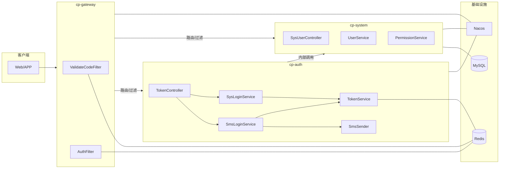
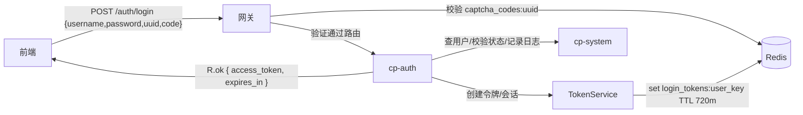
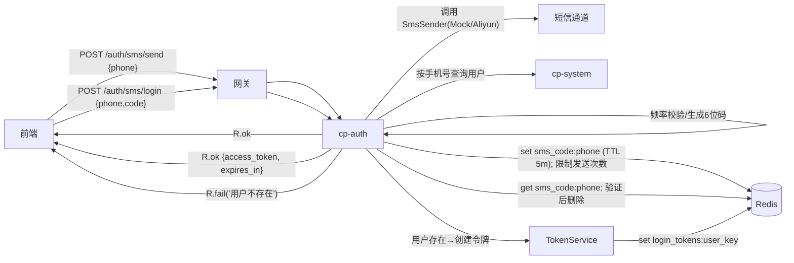
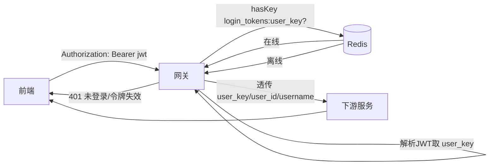
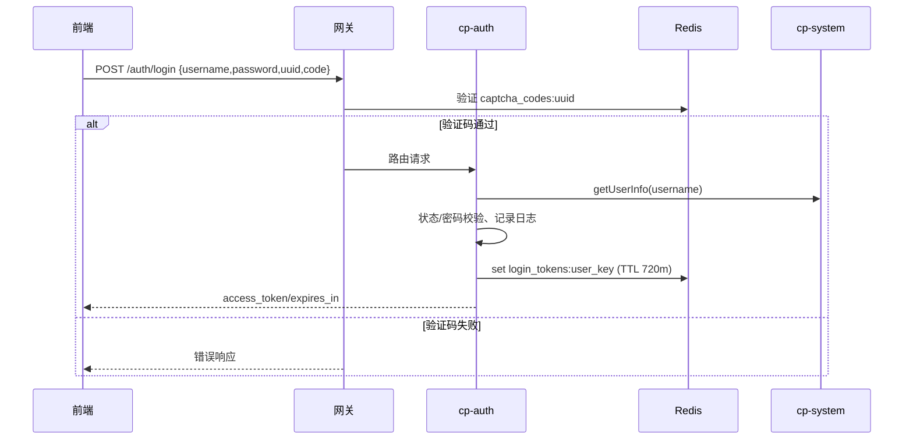
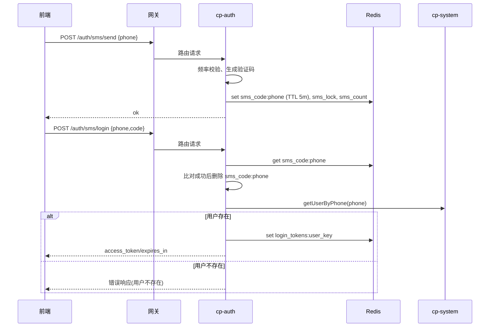

# 认证服务架构与数据流分析

## 概述

- 项目采用“网关统一入口 + 认证服务颁发令牌 + Redis会话 + JWT + 网关鉴权”的典型微服务认证架构。
- 主要模块：
  - `cp-gateway`：统一入口、验证码与鉴权过滤。
  - `cp-auth`：登录、令牌颁发、刷新、退出、短信登录等认证能力。
  - `cp-system`：用户资料、角色与权限、登录日志等系统能力（对认证服务提供用户数据）。
  - `cp-common/*`：`Redis`、`Security`、`Core` 等通用能力与常量。

## 模块角色

- 网关（`cp-gateway`）：
  - 验证码过滤器：在登录/注册路径执行图形验证码校验。
  - 鉴权过滤器：解析前端 `JWT`，校验会话在线，并把用户信息透传到下游。
- 认证服务（`cp-auth`）：
  - 账号密码登录、短信验证码登录、令牌刷新与退出。
  - 令牌颁发与会话写入 `Redis`。
- 系统服务（`cp-system`）：
  - 通过内部接口提供“按用户名/手机号获取用户”与记录登录日志等能力。

## 架构图

## 数据流图

### 账号密码登录

### 短信验证码登录

### 网关鉴权

## 核心实现

- 令牌创建与会话写入：`cp-common/cp-common-security/src/main/java/com/cp/common/security/service/TokenService.java:48-69,161-168`
  - 生成 `user_key`（`UUID`），组装 `JWT` 载荷（`user_key/user_id/username`）。
  - 写入会话：`login_tokens:<user_key>`，过期时间为 `CacheConstants.EXPIRATION` 分钟。
- 会话键前缀与过期策略：`cp-common/cp-common-core/src/main/java/com/cp/common/core/constant/CacheConstants.java:13,18,33`
  - `EXPIRATION=720`（分钟，默认），`REFRESH_TIME=120`（分钟阈值），`LOGIN_TOKEN_KEY="login_tokens:"`。
- 网关鉴权：`cp-gateway/src/main/java/com/cp/gateway/filter/AuthFilter.java:64-69,77-83`
  - 解析 `JWT` → 取 `user_key` → `Redis.hasKey("login_tokens:"+user_key)` 校验在线。
  - 成功后把 `user_key/user_id/username` 注入下游请求头，继续路由。

## 认证流程

### 账号密码登录

1. 前端 `POST /auth/login` 携带 `username/password` 与图形验证码 `uuid/code`。
2. 网关上执行图形验证码过滤；通过后路由到 `cp-auth`。
3. 认证服务登录校验：`cp-auth/src/main/java/com/cp/auth/service/SysLoginService.java:45`
   - 远程查用户、校验删除/停用状态、密码错误计数与锁定策略。
   - 记录登录日志，创建会话与令牌（调用 `TokenService`）。
4. 返回 `{ access_token, expires_in }`；前端持久化令牌。

### 短信验证码登录

1. 发送验证码 `POST /auth/sms/send`：
   - 认证服务生成 6 位验证码，通过抽象 `SmsSender` 发送（Mock/阿里云，条件装配）。
   - 写入 `Redis`：`sms_code:<phone>`（5 分钟）、`sms_lock:<phone>`（重发间隔秒）、`sms_count:<phone>:<date>`（当日次数）。
2. 验证登录 `POST /auth/sms/login`：
   - 从 `Redis` 读取并比对 `sms_code:<phone>`，通过后删除验证码键。
   - 远程查询用户：`cp-auth/src/main/java/com/cp/auth/service/SmsLoginService.java:116-133`（现已改为“不存在直接返回错误”）。
   - 创建令牌与会话：`TokenService#createToken`。

## 网关鉴权数据流

- 前端在受保护接口请求头携带 `Authorization: Bearer <jwt>`。
- 网关 `AuthFilter`：解析 `jwt` → 取 `user_key` → `Redis.hasKey("login_tokens:"+user_key)` 校验在线。
- 成功：注入用户信息头并转发；失败：返回未登录/令牌失效。

## Redis 键设计

- `login_tokens:<user_key>`：登录会话，值为 `LoginUser`，TTL `EXPIRATION` 分钟。
- `captcha_codes:<uuid>`：图形验证码（网关校验使用）。
- `sms_code:<phone>`：短信验证码，TTL 5 分钟。
- `sms_lock:<phone>`：发送锁，TTL 重发间隔秒。
- `sms_count:<phone>:<date>`：当日发送次数，TTL 1 天。
- `pwd_err_cnt:<username>`：密码错误次数与锁定策略计数。

## 时序图

### 账号密码登录

### 短信验证码登录

## 配置与条件装配（短信通道）

- Mock 通道（开发模式）：`-Dsms.mock.enabled=true`
- 阿里云通道（生产模式）：`-Dsms.mock.enabled=false`，并配置 `aliyun.sms.*`。
- 发送器条件装配：
  - `cp-auth/src/main/java/com/cp/auth/service/AliyunSmsSender.java` 使用 `@ConditionalOnProperty(prefix="sms.mock", name="enabled", havingValue="false", matchIfMissing=true)`。
  - `cp-auth/src/main/java/com/cp/auth/service/MockSmsSender.java` 使用 `@ConditionalOnProperty(prefix="sms.mock", name="enabled", havingValue="true")`。

## 安全策略与风控

- 图形验证码：登录/注册前置校验（网关）。
- 密码错误计数与锁定：`pwd_err_cnt:<username>`（`SysPasswordService`）。
- IP 黑名单：网关读取 `CacheConstants.SYS_LOGIN_BLACKIPLIST` 配置拦截。
- 短信频率限制：发送锁与每日次数；支持白名单与万能码（仅开发模式，生产禁用）。

## 关键代码位置（参考）

- 令牌与会话：`cp-common/cp-common-security/src/main/java/com/cp/common/security/service/TokenService.java:48-69,161-168`
- 会话键常量：`cp-common/cp-common-core/src/main/java/com/cp/common/core/constant/CacheConstants.java:13,18,33`
- 网关鉴权：`cp-gateway/src/main/java/com/cp/gateway/filter/AuthFilter.java:64-69,77-83`
- 账号密码登录：`cp-auth/src/main/java/com/cp/auth/service/SysLoginService.java:45`
- 短信登录服务：`cp-auth/src/main/java/com/cp/auth/service/SmsLoginService.java:99-133`
- 系统用户手机号查询：`cp-modules/cp-system/src/main/java/com/cp/system/controller/SysUserController.java:69-84`

## 测试建议

- 开发模式启动：`-Dspring.profiles.active=dev -Dsms.mock.enabled=true`
- 发送验证码 → 验证登录 → 携带令牌访问受保护接口。
- 验证 `Redis` 键是否正确写入与过期：`sms_code:*`、`sms_lock:*`、`sms_count:*`、`login_tokens:*`。