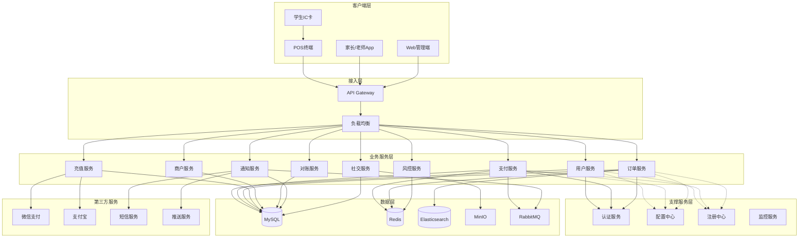
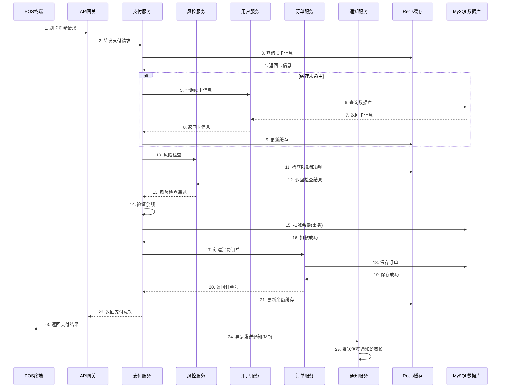
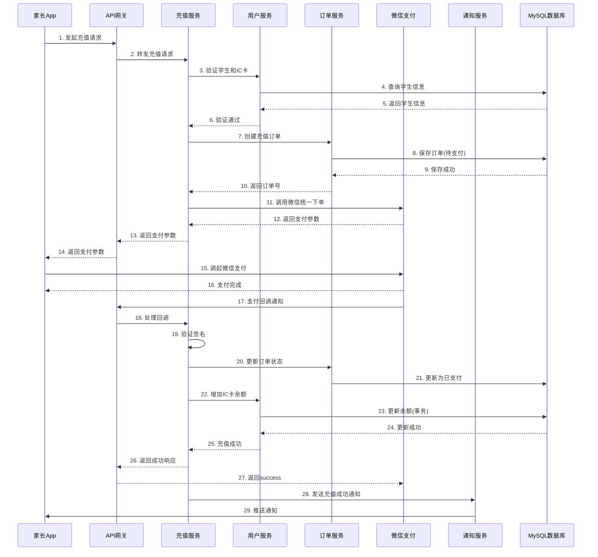
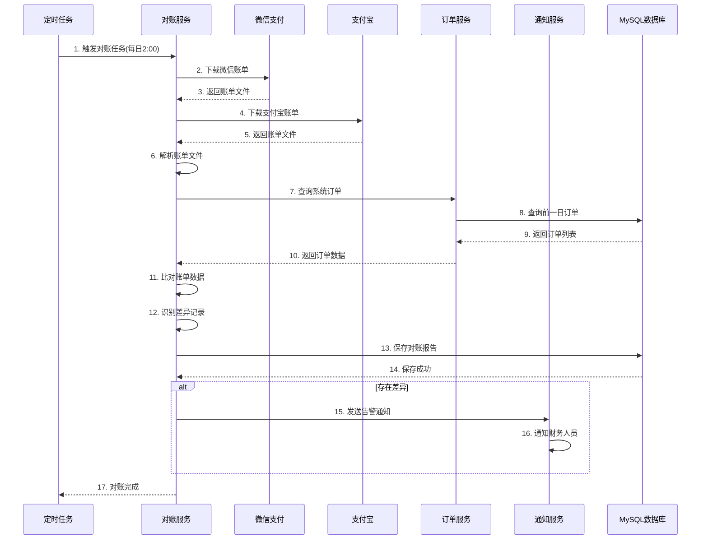
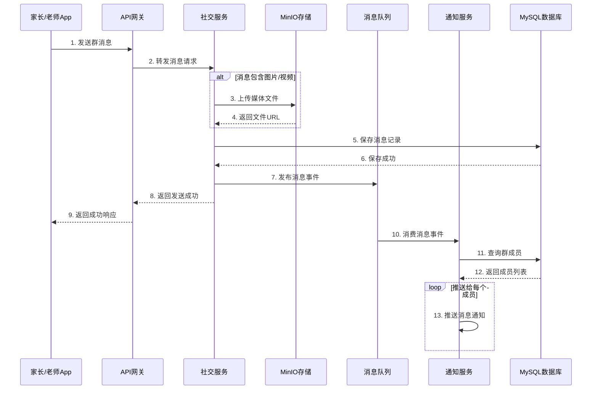

# 	校园支付系统设计文档

## 1. 概述

### 1.1 系统简介

校园支付系统是一个基于微服务架构的综合支付解决方案，服务于学生、家长、老师和学校管理员四类用户。系统核心功能包括IC卡刷卡消费、在线充值、消费查询、家校互动、商户管理和财务对账。

### 1.2 设计目标

- **高可用性**: 系统可用性达到99.9%以上，支持7x24小时不间断服务
- **高性能**: 支付请求响应时间小于1秒，支持每秒1000笔并发交易
- **安全性**: 符合PCI DSS标准，保障资金和数据安全
- **可扩展性**: 采用微服务架构，支持水平扩展和功能模块独立部署
- **易用性**: 提供友好的用户界面，简化操作流程

### 1.3 技术栈选型

**后端技术栈:**

- ### **核心技术栈清单**

  | 类别               | 技术选型                                                     | 说明与核心作用                                               |
  | ------------------ | ------------------------------------------------------------ | ------------------------------------------------------------ |
  | **开发语言**       | Java 17                                                      | 采用 LTS 版本，支持密封类、Records、增强的 switch 等新特性，提升开发效率与代码安全性。 |
  | **基础框架**       | Spring Boot 3.x                                              | 微服务应用开发基石，支持自动配置、 starters 依赖管理，适配 Java 17 及 Jakarta EE 规范。 |
  | **微服务生态**     | Spring Cloud Alibaba 2022.x                                  | 整合阿里云中间件与 Spring Cloud 标准，提供服务治理、配置管理等一站式解决方案。 |
  | **服务注册与发现** | Nacos 2.x                                                    | 同时作为服务注册中心（支持 DNS/REST 协议）和动态配置中心，兼容 Dubbo 与 Spring Cloud 服务发现。 |
  | **配置中心**       | Nacos Config                                                 | 与注册中心一体化，支持配置动态推送、多环境隔离、配置版本管理，无需额外部署组件。 |
  | **API 网关**       | Spring Cloud Gateway 4.x                                     | 基于 Netty 的异步非阻塞网关，处理路由转发、鉴权、限流（结合 Sentinel），适配 HTTP/HTTPS 协议。 |
  | **负载均衡**       | 分层方案：- Dubbo LoadBalance（服务间 RPC）- Spring Cloud LoadBalancer（网关到服务） | 服务间 RPC 调用用 Dubbo 内置策略（如最少活跃调用），网关层 HTTP 转发用 Spring Cloud 适配方案，各司其职。 |
  | **服务调用**       | Apache Dubbo 3.x                                             | 高性能 RPC 框架，支持 Triple 协议（兼容 gRPC/HTTP/JSON）、服务治理（负载均衡、超时控制），与 Nacos 深度集成。 |
  | **熔断降级**       | Sentinel 1.8.x                                               | 对 Dubbo 服务、Gateway 网关进行流量控制（QPS / 并发数）、熔断降级（错误率 / 响应时间），保护系统过载。 |
  | **分布式事务**     | Seata 1.6.x                                                  | 支持 AT（自动补偿）、TCC 模式，解决跨服务事务一致性问题，与 Dubbo、Spring 事务注解无缝集成。 |
  | **消息队列**       | RabbitMQ 3.12.x                                              | 基于 AMQP 协议，支持死信队列、延迟队列、消息确认，用于异步通信（如订单状态变更通知）、削峰填谷。 |
  | **缓存**           | Redis 7.x                                                    | 高性能 KV 缓存，支持分布式锁（Redisson）、缓存预热、过期策略，缓解数据库压力，提升接口响应速度。 |
  | **数据库**         | MySQL 8.0                                                    | 关系型数据库，支持窗口函数、JSON 类型，结合 MyBatis-Plus 简化 CRUD 操作，通过 Seata 保证分布式事务。 |
  | **搜索引擎**       | elasticsearch:7.17.0                                         | 全文检索引擎，用于商品搜索、日志分析等场景，结合 Spring Data Elasticsearch 简化操作。 |
  | **对象存储**       | 阿里云 OSS                                                   | 存储非结构化数据（图片、视频、文档），兼容 S3 API，通过 SDK 快速集成，无需自建存储集群。 |
  | **链路追踪**       | skywalking-ui:8.6.0                                          | 分布式系统调用链可视化，追踪 Dubbo 调用、数据库操作、MQ 消息流转，定位性能瓶颈。 |
  | **日志收集**       | ELK Stack（Elasticsearch + Logstash + Kibana）               | Logstash 采集应用日志，Elasticsearch 存储，Kibana 可视化分析，支持日志检索与异常监控。 |

**前端技术栈:**

- Web管理端: Vue 3 + Element Plus + TypeScript
- 移动端App: HarmonyOS (鸿蒙应用开发)

**基础设施:**

- 容器化: Docker
- 容器编排: Kubernetes
- CI/CD: Jenkins
- 监控: Prometheus + Grafana

## 2. 系统架构

### 2.1 总体架构

系统采用微服务架构，分为以下几层：




### 2.2 微服务划分

#### 2.2.1 用户服务 (User Service)

**职责:**

- 管理学生、家长、老师、管理员账户信息
- 处理用户注册、登录、权限验证
- 管理IC卡信息和绑定关系
- 提供用户信息查询接口

**核心接口:**

- POST /api/user/register - 用户注册
- POST /api/user/login - 用户登录
- GET /api/user/{id} - 获取用户信息
- PUT /api/user/{id} - 更新用户信息
- POST /api/user/card/bind - 绑定IC卡
- POST /api/user/card/loss - IC卡挂失

**数据库表:**

- user - 用户基本信息表
- student - 学生信息表
- parent - 家长信息表
- teacher - 老师信息表
- ic_card - IC卡信息表
- user_relation - 用户关系表（学生-家长关联）

#### 2.2.2 支付服务 (Payment Service)

**职责:**

- 处理IC卡刷卡支付请求
- 验证IC卡状态和余额
- 执行扣款操作
- 处理支付回调
- 管理支付流水

**核心接口:**

- POST /api/payment/consume - IC卡消费
- POST /api/payment/refund - 消费退款
- GET /api/payment/balance/{cardNo} - 查询IC卡余额
- GET /api/payment/record - 查询支付记录

**数据库表:**

- payment_order - 支付订单表
- payment_record - 支付流水表
- refund_order - 退款订单表

#### 2.2.3 订单服务 (Order Service)

**职责:**

- 管理消费订单和充值订单
- 提供订单查询和统计功能
- 处理订单状态变更
- 生成订单报表

**核心接口:**

- GET /api/order/list - 订单列表查询
- GET /api/order/{orderId} - 订单详情查询
- GET /api/order/statistics - 订单统计

**数据库表:**

- consume_order - 消费订单表
- recharge_order - 充值订单表
- order_status_log - 订单状态变更日志表


#### 2.2.4 充值服务 (Recharge Service)

**职责:**

- 处理家长在线充值请求
- 对接第三方支付渠道（微信、支付宝）
- 处理支付回调和充值到账
- 管理充值记录

**核心接口:**

- POST /api/recharge/create - 创建充值订单
- POST /api/recharge/callback/wechat - 微信支付回调
- POST /api/recharge/callback/alipay - 支付宝回调
- GET /api/recharge/record - 充值记录查询

**数据库表:**

- recharge_order - 充值订单表
- payment_channel - 支付渠道配置表
- channel_transaction - 渠道交易流水表

#### 2.2.5 商户服务 (Merchant Service)

**职责:**

- 管理校园商户信息
- 管理POS终端设备
- 提供商户交易统计
- 处理商户结算

**核心接口:**

- POST /api/merchant/create - 创建商户
- PUT /api/merchant/{id} - 更新商户信息
- GET /api/merchant/list - 商户列表
- POST /api/merchant/pos/bind - 绑定POS终端
- GET /api/merchant/statistics - 商户交易统计

**数据库表:**

- merchant - 商户信息表
- pos_terminal - POS终端表
- merchant_settlement - 商户结算表

#### 2.2.6 对账服务 (Reconciliation Service)

**职责:**

- 执行每日自动对账任务
- 下载第三方支付渠道账单
- 比对系统订单和渠道账单
- 生成对账报告和差异记录

**核心接口:**

- POST /api/reconciliation/execute - 执行对账
- GET /api/reconciliation/report - 对账报告查询
- GET /api/reconciliation/difference - 差异记录查询

**数据库表:**

- reconciliation_task - 对账任务表
- reconciliation_report - 对账报告表
- reconciliation_difference - 对账差异表

#### 2.2.7 通知服务 (Notification Service)

**职责:**

- 发送消费通知给家长
- 发送充值成功通知
- 发送系统通知和公告
- 管理消息模板

**核心接口:**

- POST /api/notification/send - 发送通知
- GET /api/notification/list - 通知列表
- POST /api/notification/template - 创建消息模板

**数据库表:**

- notification - 通知记录表
- notification_template - 通知模板表
- push_log - 推送日志表


#### 2.2.8 社交服务 (Social Service)

**职责:**

- 管理班级群组
- 处理群消息发送和接收
- 管理群成员和权限
- 存储聊天记录和媒体文件

**核心接口:**

- POST /api/social/group/create - 创建班级群
- POST /api/social/group/member/add - 添加群成员
- POST /api/social/message/send - 发送群消息
- GET /api/social/message/history - 获取聊天记录

**数据库表:**

- class_group - 班级群表
- group_member - 群成员表
- group_message - 群消息表
- group_announcement - 群公告表

#### 2.2.9 风控服务 (Risk Control Service)

**职责:**

- 实时监测交易风险
- 验证消费限额
- 识别异常交易模式
- 执行风控规则引擎

**核心接口:**

- POST /api/risk/check - 风险检查
- POST /api/risk/rule/create - 创建风控规则
- GET /api/risk/event/list - 风险事件列表

**数据库表:**

- risk_rule - 风控规则表
- risk_event - 风险事件表
- consumption_limit - 消费限额配置表

#### 2.2.10 认证服务 (Auth Service)

**职责:**

- 统一身份认证
- JWT令牌生成和验证
- 权限管理
- 单点登录(SSO)

**核心接口:**

- POST /api/auth/login - 登录认证
- POST /api/auth/logout - 退出登录
- POST /api/auth/refresh - 刷新令牌
- GET /api/auth/verify - 验证令牌

**数据库表:**

- auth_token - 令牌表
- role - 角色表
- permission - 权限表
- role_permission - 角色权限关联表

## 3. 核心业务流程

### 3.1 IC卡刷卡消费流程




**关键设计点:**

1. 使用Redis缓存IC卡信息，减少数据库查询，提升响应速度
2. 风控检查前置，在扣款前进行风险评估
3. 使用数据库事务保证扣款操作的原子性
4. 通知异步发送，不阻塞主流程
5. 支付响应时间控制在1秒以内

### 3.2 家长在线充值流程



**关键设计点:**

1. 订单先创建为待支付状态，支付成功后更新
2. 严格验证第三方支付回调签名，防止伪造
3. 充值到账使用数据库事务，保证数据一致性
4. 支持幂等性处理，防止重复充值
5. 异步通知家长充值结果


### 3.3 每日自动对账流程



**关键设计点:**

1. 定时任务在凌晨2点执行，避开业务高峰期
2. 支持多渠道账单并行下载
3. 自动识别长款、短款、金额不符等差异
4. 差异记录需要人工审核处理
5. 对账结果可导出Excel供财务核对

### 3.4 班级群消息流程



**关键设计点:**

1. 媒体文件存储在MinIO对象存储中
2. 消息发送和推送解耦，提升响应速度
3. 使用消息队列异步推送，支持大量用户
4. 支持消息已读未读状态
5. 聊天记录支持分页查询和搜索

## 4. 数据模型设计

### 4.1 用户相关表

#### user - 用户表

```sql
CREATE TABLE user (
    id BIGINT PRIMARY KEY AUTO_INCREMENT,
    username VARCHAR(50) NOT NULL UNIQUE COMMENT '用户名',
    password VARCHAR(255) NOT NULL COMMENT '密码(加密)',
    user_type TINYINT NOT NULL COMMENT '用户类型:1-学生,2-家长,3-老师,4-管理员',
    real_name VARCHAR(50) NOT NULL COMMENT '真实姓名',
    phone VARCHAR(20) COMMENT '手机号',
    status TINYINT DEFAULT 1 COMMENT '状态:0-禁用,1-正常',
    created_at DATETIME DEFAULT CURRENT_TIMESTAMP,
    updated_at DATETIME DEFAULT CURRENT_TIMESTAMP ON UPDATE CURRENT_TIMESTAMP,
    INDEX idx_username (username),
    INDEX idx_phone (phone),
    INDEX idx_user_type (user_type)
) ENGINE=InnoDB DEFAULT CHARSET=utf8mb4 COMMENT='用户表';
```


#### student - 学生表

```sql
CREATE TABLE student (
    id BIGINT PRIMARY KEY AUTO_INCREMENT,
    user_id BIGINT NOT NULL COMMENT '用户ID',
    student_no VARCHAR(30) NOT NULL UNIQUE COMMENT '学号',
    grade VARCHAR(20) COMMENT '年级',
    class_name VARCHAR(50) COMMENT '班级',
    gender TINYINT COMMENT '性别:1-男,2-女',
    id_card VARCHAR(18) COMMENT '身份证号',
    created_at DATETIME DEFAULT CURRENT_TIMESTAMP,
    updated_at DATETIME DEFAULT CURRENT_TIMESTAMP ON UPDATE CURRENT_TIMESTAMP,
    FOREIGN KEY (user_id) REFERENCES user(id),
    INDEX idx_student_no (student_no),
    INDEX idx_class (grade, class_name)
) ENGINE=InnoDB DEFAULT CHARSET=utf8mb4 COMMENT='学生表';
```

#### parent - 家长表

```sql
CREATE TABLE parent (
    id BIGINT PRIMARY KEY AUTO_INCREMENT,
    user_id BIGINT NOT NULL COMMENT '用户ID',
    relation VARCHAR(20) COMMENT '与学生关系',
    created_at DATETIME DEFAULT CURRENT_TIMESTAMP,
    updated_at DATETIME DEFAULT CURRENT_TIMESTAMP ON UPDATE CURRENT_TIMESTAMP,
    FOREIGN KEY (user_id) REFERENCES user(id)
) ENGINE=InnoDB DEFAULT CHARSET=utf8mb4 COMMENT='家长表';
```

#### teacher - 老师表

```sql
CREATE TABLE teacher (
    id BIGINT PRIMARY KEY AUTO_INCREMENT,
    user_id BIGINT NOT NULL COMMENT '用户ID',
    teacher_no VARCHAR(30) COMMENT '工号',
    subject VARCHAR(50) COMMENT '任教科目',
    created_at DATETIME DEFAULT CURRENT_TIMESTAMP,
    updated_at DATETIME DEFAULT CURRENT_TIMESTAMP ON UPDATE CURRENT_TIMESTAMP,
    FOREIGN KEY (user_id) REFERENCES user(id),
    INDEX idx_teacher_no (teacher_no)
) ENGINE=InnoDB DEFAULT CHARSET=utf8mb4 COMMENT='老师表';
```

#### ic_card - IC卡表

```sql
CREATE TABLE ic_card (
    id BIGINT PRIMARY KEY AUTO_INCREMENT,
    card_no VARCHAR(30) NOT NULL UNIQUE COMMENT '卡号',
    student_id BIGINT NOT NULL COMMENT '学生ID',
    balance DECIMAL(10,2) DEFAULT 0.00 COMMENT '余额',
    status TINYINT DEFAULT 1 COMMENT '状态:0-挂失,1-正常,2-注销',
    loss_time DATETIME COMMENT '挂失时间',
    created_at DATETIME DEFAULT CURRENT_TIMESTAMP,
    updated_at DATETIME DEFAULT CURRENT_TIMESTAMP ON UPDATE CURRENT_TIMESTAMP,
    FOREIGN KEY (student_id) REFERENCES student(id),
    INDEX idx_card_no (card_no),
    INDEX idx_student_id (student_id)
) ENGINE=InnoDB DEFAULT CHARSET=utf8mb4 COMMENT='IC卡表';
```

#### user_relation - 用户关系表

```sql
CREATE TABLE user_relation (
    id BIGINT PRIMARY KEY AUTO_INCREMENT,
    student_id BIGINT NOT NULL COMMENT '学生ID',
    parent_id BIGINT NOT NULL COMMENT '家长ID',
    relation VARCHAR(20) COMMENT '关系',
    created_at DATETIME DEFAULT CURRENT_TIMESTAMP,
    FOREIGN KEY (student_id) REFERENCES student(id),
    FOREIGN KEY (parent_id) REFERENCES parent(id),
    UNIQUE KEY uk_student_parent (student_id, parent_id)
) ENGINE=InnoDB DEFAULT CHARSET=utf8mb4 COMMENT='用户关系表';
```

### 4.2 订单相关表

#### consume_order - 消费订单表

```sql
CREATE TABLE consume_order (
    id BIGINT PRIMARY KEY AUTO_INCREMENT,
    order_no VARCHAR(32) NOT NULL UNIQUE COMMENT '订单号',
    student_id BIGINT NOT NULL COMMENT '学生ID',
    card_no VARCHAR(30) NOT NULL COMMENT '卡号',
    merchant_id BIGINT NOT NULL COMMENT '商户ID',
    pos_id BIGINT COMMENT 'POS终端ID',
    amount DECIMAL(10,2) NOT NULL COMMENT '消费金额',
    balance_before DECIMAL(10,2) COMMENT '消费前余额',
    balance_after DECIMAL(10,2) COMMENT '消费后余额',
    status TINYINT DEFAULT 1 COMMENT '状态:1-成功,2-失败,3-已退款',
    consume_time DATETIME NOT NULL COMMENT '消费时间',
    created_at DATETIME DEFAULT CURRENT_TIMESTAMP,
    updated_at DATETIME DEFAULT CURRENT_TIMESTAMP ON UPDATE CURRENT_TIMESTAMP,
    INDEX idx_order_no (order_no),
    INDEX idx_student_id (student_id),
    INDEX idx_merchant_id (merchant_id),
    INDEX idx_consume_time (consume_time)
) ENGINE=InnoDB DEFAULT CHARSET=utf8mb4 COMMENT='消费订单表';
```


#### recharge_order - 充值订单表

```sql
CREATE TABLE recharge_order (
    id BIGINT PRIMARY KEY AUTO_INCREMENT,
    order_no VARCHAR(32) NOT NULL UNIQUE COMMENT '订单号',
    student_id BIGINT NOT NULL COMMENT '学生ID',
    parent_id BIGINT NOT NULL COMMENT '家长ID',
    card_no VARCHAR(30) NOT NULL COMMENT '卡号',
    amount DECIMAL(10,2) NOT NULL COMMENT '充值金额',
    channel VARCHAR(20) NOT NULL COMMENT '支付渠道:wechat,alipay',
    channel_order_no VARCHAR(64) COMMENT '渠道订单号',
    status TINYINT DEFAULT 0 COMMENT '状态:0-待支付,1-已支付,2-已关闭',
    pay_time DATETIME COMMENT '支付时间',
    created_at DATETIME DEFAULT CURRENT_TIMESTAMP,
    updated_at DATETIME DEFAULT CURRENT_TIMESTAMP ON UPDATE CURRENT_TIMESTAMP,
    INDEX idx_order_no (order_no),
    INDEX idx_student_id (student_id),
    INDEX idx_parent_id (parent_id),
    INDEX idx_channel_order_no (channel_order_no)
) ENGINE=InnoDB DEFAULT CHARSET=utf8mb4 COMMENT='充值订单表';
```

#### refund_order - 退款订单表

```sql
CREATE TABLE refund_order (
    id BIGINT PRIMARY KEY AUTO_INCREMENT,
    refund_no VARCHAR(32) NOT NULL UNIQUE COMMENT '退款单号',
    consume_order_id BIGINT NOT NULL COMMENT '原消费订单ID',
    student_id BIGINT NOT NULL COMMENT '学生ID',
    card_no VARCHAR(30) NOT NULL COMMENT '卡号',
    refund_amount DECIMAL(10,2) NOT NULL COMMENT '退款金额',
    reason VARCHAR(200) COMMENT '退款原因',
    operator_id BIGINT COMMENT '操作人ID',
    status TINYINT DEFAULT 0 COMMENT '状态:0-处理中,1-成功,2-失败',
    refund_time DATETIME COMMENT '退款时间',
    created_at DATETIME DEFAULT CURRENT_TIMESTAMP,
    updated_at DATETIME DEFAULT CURRENT_TIMESTAMP ON UPDATE CURRENT_TIMESTAMP,
    INDEX idx_refund_no (refund_no),
    INDEX idx_consume_order_id (consume_order_id)
) ENGINE=InnoDB DEFAULT CHARSET=utf8mb4 COMMENT='退款订单表';
```

### 4.3 商户相关表

#### merchant - 商户表

```sql
CREATE TABLE merchant (
    id BIGINT PRIMARY KEY AUTO_INCREMENT,
    merchant_no VARCHAR(30) NOT NULL UNIQUE COMMENT '商户编号',
    merchant_name VARCHAR(100) NOT NULL COMMENT '商户名称',
    merchant_type VARCHAR(50) COMMENT '商户类型:食堂,超市,图书馆等',
    contact_name VARCHAR(50) COMMENT '联系人',
    contact_phone VARCHAR(20) COMMENT '联系电话',
    settlement_account VARCHAR(50) COMMENT '结算账户',
    fee_rate DECIMAL(5,4) DEFAULT 0 COMMENT '手续费率',
    status TINYINT DEFAULT 1 COMMENT '状态:0-禁用,1-正常',
    created_at DATETIME DEFAULT CURRENT_TIMESTAMP,
    updated_at DATETIME DEFAULT CURRENT_TIMESTAMP ON UPDATE CURRENT_TIMESTAMP,
    INDEX idx_merchant_no (merchant_no),
    INDEX idx_merchant_type (merchant_type)
) ENGINE=InnoDB DEFAULT CHARSET=utf8mb4 COMMENT='商户表';
```

#### pos_terminal - POS终端表

```sql
CREATE TABLE pos_terminal (
    id BIGINT PRIMARY KEY AUTO_INCREMENT,
    terminal_no VARCHAR(30) NOT NULL UNIQUE COMMENT '终端编号',
    merchant_id BIGINT NOT NULL COMMENT '商户ID',
    terminal_name VARCHAR(100) COMMENT '终端名称',
    location VARCHAR(200) COMMENT '安装位置',
    status TINYINT DEFAULT 1 COMMENT '状态:0-禁用,1-正常',
    last_online_time DATETIME COMMENT '最后在线时间',
    created_at DATETIME DEFAULT CURRENT_TIMESTAMP,
    updated_at DATETIME DEFAULT CURRENT_TIMESTAMP ON UPDATE CURRENT_TIMESTAMP,
    FOREIGN KEY (merchant_id) REFERENCES merchant(id),
    INDEX idx_terminal_no (terminal_no),
    INDEX idx_merchant_id (merchant_id)
) ENGINE=InnoDB DEFAULT CHARSET=utf8mb4 COMMENT='POS终端表';
```

#### merchant_settlement - 商户结算表

```sql
CREATE TABLE merchant_settlement (
    id BIGINT PRIMARY KEY AUTO_INCREMENT,
    settlement_no VARCHAR(32) NOT NULL UNIQUE COMMENT '结算单号',
    merchant_id BIGINT NOT NULL COMMENT '商户ID',
    settlement_date DATE NOT NULL COMMENT '结算日期',
    total_amount DECIMAL(12,2) NOT NULL COMMENT '总交易金额',
    fee_amount DECIMAL(12,2) DEFAULT 0 COMMENT '手续费',
    settlement_amount DECIMAL(12,2) NOT NULL COMMENT '结算金额',
    status TINYINT DEFAULT 0 COMMENT '状态:0-待结算,1-已结算',
    settlement_time DATETIME COMMENT '结算时间',
    created_at DATETIME DEFAULT CURRENT_TIMESTAMP,
    updated_at DATETIME DEFAULT CURRENT_TIMESTAMP ON UPDATE CURRENT_TIMESTAMP,
    FOREIGN KEY (merchant_id) REFERENCES merchant(id),
    INDEX idx_settlement_no (settlement_no),
    INDEX idx_merchant_id (merchant_id),
    INDEX idx_settlement_date (settlement_date)
) ENGINE=InnoDB DEFAULT CHARSET=utf8mb4 COMMENT='商户结算表';
```


### 4.4 社交相关表

#### class_group - 班级群表

```sql
CREATE TABLE class_group (
    id BIGINT PRIMARY KEY AUTO_INCREMENT,
    group_no VARCHAR(30) NOT NULL UNIQUE COMMENT '群编号',
    group_name VARCHAR(100) NOT NULL COMMENT '群名称',
    grade VARCHAR(20) COMMENT '年级',
    class_name VARCHAR(50) COMMENT '班级',
    owner_id BIGINT NOT NULL COMMENT '群主ID(老师)',
    avatar VARCHAR(255) COMMENT '群头像',
    announcement TEXT COMMENT '群公告',
    member_count INT DEFAULT 0 COMMENT '成员数量',
    status TINYINT DEFAULT 1 COMMENT '状态:0-解散,1-正常',
    created_at DATETIME DEFAULT CURRENT_TIMESTAMP,
    updated_at DATETIME DEFAULT CURRENT_TIMESTAMP ON UPDATE CURRENT_TIMESTAMP,
    INDEX idx_group_no (group_no),
    INDEX idx_owner_id (owner_id),
    INDEX idx_class (grade, class_name)
) ENGINE=InnoDB DEFAULT CHARSET=utf8mb4 COMMENT='班级群表';
```

#### group_member - 群成员表

```sql
CREATE TABLE group_member (
    id BIGINT PRIMARY KEY AUTO_INCREMENT,
    group_id BIGINT NOT NULL COMMENT '群ID',
    user_id BIGINT NOT NULL COMMENT '用户ID',
    role TINYINT DEFAULT 1 COMMENT '角色:1-普通成员,2-管理员,3-群主',
    nickname VARCHAR(50) COMMENT '群昵称',
    mute TINYINT DEFAULT 0 COMMENT '是否禁言:0-否,1-是',
    join_time DATETIME DEFAULT CURRENT_TIMESTAMP COMMENT '加入时间',
    FOREIGN KEY (group_id) REFERENCES class_group(id),
    FOREIGN KEY (user_id) REFERENCES user(id),
    UNIQUE KEY uk_group_user (group_id, user_id),
    INDEX idx_group_id (group_id),
    INDEX idx_user_id (user_id)
) ENGINE=InnoDB DEFAULT CHARSET=utf8mb4 COMMENT='群成员表';
```

#### group_message - 群消息表

```sql
CREATE TABLE group_message (
    id BIGINT PRIMARY KEY AUTO_INCREMENT,
    group_id BIGINT NOT NULL COMMENT '群ID',
    sender_id BIGINT NOT NULL COMMENT '发送者ID',
    message_type TINYINT NOT NULL COMMENT '消息类型:1-文字,2-图片,3-视频,4-语音',
    content TEXT COMMENT '消息内容',
    media_url VARCHAR(255) COMMENT '媒体文件URL',
    send_time DATETIME DEFAULT CURRENT_TIMESTAMP COMMENT '发送时间',
    FOREIGN KEY (group_id) REFERENCES class_group(id),
    FOREIGN KEY (sender_id) REFERENCES user(id),
    INDEX idx_group_id (group_id),
    INDEX idx_send_time (send_time)
) ENGINE=InnoDB DEFAULT CHARSET=utf8mb4 COMMENT='群消息表';
```

#### message_read_status - 消息阅读状态表

```sql
CREATE TABLE message_read_status (
    id BIGINT PRIMARY KEY AUTO_INCREMENT,
    message_id BIGINT NOT NULL COMMENT '消息ID',
    user_id BIGINT NOT NULL COMMENT '用户ID',
    read_time DATETIME COMMENT '阅读时间',
    FOREIGN KEY (message_id) REFERENCES group_message(id),
    FOREIGN KEY (user_id) REFERENCES user(id),
    UNIQUE KEY uk_message_user (message_id, user_id),
    INDEX idx_message_id (message_id),
    INDEX idx_user_id (user_id)
) ENGINE=InnoDB DEFAULT CHARSET=utf8mb4 COMMENT='消息阅读状态表';
```

### 4.5 风控相关表

#### risk_rule - 风控规则表

```sql
CREATE TABLE risk_rule (
    id BIGINT PRIMARY KEY AUTO_INCREMENT,
    rule_name VARCHAR(100) NOT NULL COMMENT '规则名称',
    rule_type VARCHAR(50) NOT NULL COMMENT '规则类型:单笔限额,日累计限额,异地消费等',
    rule_config JSON COMMENT '规则配置(JSON格式)',
    priority INT DEFAULT 0 COMMENT '优先级',
    status TINYINT DEFAULT 1 COMMENT '状态:0-禁用,1-启用',
    created_at DATETIME DEFAULT CURRENT_TIMESTAMP,
    updated_at DATETIME DEFAULT CURRENT_TIMESTAMP ON UPDATE CURRENT_TIMESTAMP,
    INDEX idx_rule_type (rule_type),
    INDEX idx_priority (priority)
) ENGINE=InnoDB DEFAULT CHARSET=utf8mb4 COMMENT='风控规则表';
```

#### risk_event - 风险事件表

```sql
CREATE TABLE risk_event (
    id BIGINT PRIMARY KEY AUTO_INCREMENT,
    event_no VARCHAR(32) NOT NULL UNIQUE COMMENT '事件编号',
    student_id BIGINT NOT NULL COMMENT '学生ID',
    card_no VARCHAR(30) COMMENT '卡号',
    event_type VARCHAR(50) NOT NULL COMMENT '事件类型',
    risk_level TINYINT NOT NULL COMMENT '风险等级:1-低,2-中,3-高',
    description TEXT COMMENT '事件描述',
    order_no VARCHAR(32) COMMENT '关联订单号',
    status TINYINT DEFAULT 0 COMMENT '处理状态:0-待处理,1-已处理,2-已忽略',
    handler_id BIGINT COMMENT '处理人ID',
    handle_time DATETIME COMMENT '处理时间',
    created_at DATETIME DEFAULT CURRENT_TIMESTAMP,
    INDEX idx_event_no (event_no),
    INDEX idx_student_id (student_id),
    INDEX idx_status (status),
    INDEX idx_created_at (created_at)
) ENGINE=InnoDB DEFAULT CHARSET=utf8mb4 COMMENT='风险事件表';
```


#### consumption_limit - 消费限额配置表

```sql
CREATE TABLE consumption_limit (
    id BIGINT PRIMARY KEY AUTO_INCREMENT,
    student_id BIGINT NOT NULL COMMENT '学生ID',
    single_limit DECIMAL(10,2) COMMENT '单笔限额',
    daily_limit DECIMAL(10,2) COMMENT '日累计限额',
    set_by BIGINT COMMENT '设置人ID(家长)',
    created_at DATETIME DEFAULT CURRENT_TIMESTAMP,
    updated_at DATETIME DEFAULT CURRENT_TIMESTAMP ON UPDATE CURRENT_TIMESTAMP,
    FOREIGN KEY (student_id) REFERENCES student(id),
    UNIQUE KEY uk_student_id (student_id)
) ENGINE=InnoDB DEFAULT CHARSET=utf8mb4 COMMENT='消费限额配置表';
```

### 4.6 对账相关表

#### reconciliation_task - 对账任务表

```sql
CREATE TABLE reconciliation_task (
    id BIGINT PRIMARY KEY AUTO_INCREMENT,
    task_no VARCHAR(32) NOT NULL UNIQUE COMMENT '任务编号',
    recon_date DATE NOT NULL COMMENT '对账日期',
    channel VARCHAR(20) NOT NULL COMMENT '支付渠道',
    status TINYINT DEFAULT 0 COMMENT '状态:0-进行中,1-完成,2-失败',
    total_count INT DEFAULT 0 COMMENT '总笔数',
    match_count INT DEFAULT 0 COMMENT '匹配笔数',
    diff_count INT DEFAULT 0 COMMENT '差异笔数',
    start_time DATETIME COMMENT '开始时间',
    end_time DATETIME COMMENT '结束时间',
    created_at DATETIME DEFAULT CURRENT_TIMESTAMP,
    INDEX idx_task_no (task_no),
    INDEX idx_recon_date (recon_date),
    INDEX idx_channel (channel)
) ENGINE=InnoDB DEFAULT CHARSET=utf8mb4 COMMENT='对账任务表';
```

#### reconciliation_difference - 对账差异表

```sql
CREATE TABLE reconciliation_difference (
    id BIGINT PRIMARY KEY AUTO_INCREMENT,
    task_id BIGINT NOT NULL COMMENT '对账任务ID',
    diff_type TINYINT NOT NULL COMMENT '差异类型:1-长款,2-短款,3-金额不符',
    order_no VARCHAR(32) COMMENT '系统订单号',
    channel_order_no VARCHAR(64) COMMENT '渠道订单号',
    system_amount DECIMAL(10,2) COMMENT '系统金额',
    channel_amount DECIMAL(10,2) COMMENT '渠道金额',
    status TINYINT DEFAULT 0 COMMENT '处理状态:0-待处理,1-已处理',
    handler_id BIGINT COMMENT '处理人ID',
    handle_remark TEXT COMMENT '处理备注',
    handle_time DATETIME COMMENT '处理时间',
    created_at DATETIME DEFAULT CURRENT_TIMESTAMP,
    FOREIGN KEY (task_id) REFERENCES reconciliation_task(id),
    INDEX idx_task_id (task_id),
    INDEX idx_order_no (order_no)
) ENGINE=InnoDB DEFAULT CHARSET=utf8mb4 COMMENT='对账差异表';
```

### 4.7 通知相关表

#### notification - 通知表

```sql
CREATE TABLE notification (
    id BIGINT PRIMARY KEY AUTO_INCREMENT,
    notify_no VARCHAR(32) NOT NULL UNIQUE COMMENT '通知编号',
    user_id BIGINT NOT NULL COMMENT '接收用户ID',
    notify_type VARCHAR(50) NOT NULL COMMENT '通知类型:消费通知,充值通知,系统通知等',
    title VARCHAR(200) NOT NULL COMMENT '通知标题',
    content TEXT COMMENT '通知内容',
    related_id BIGINT COMMENT '关联业务ID',
    is_read TINYINT DEFAULT 0 COMMENT '是否已读:0-未读,1-已读',
    read_time DATETIME COMMENT '阅读时间',
    send_time DATETIME DEFAULT CURRENT_TIMESTAMP COMMENT '发送时间',
    FOREIGN KEY (user_id) REFERENCES user(id),
    INDEX idx_notify_no (notify_no),
    INDEX idx_user_id (user_id),
    INDEX idx_is_read (is_read),
    INDEX idx_send_time (send_time)
) ENGINE=InnoDB DEFAULT CHARSET=utf8mb4 COMMENT='通知表';
```

#### school_announcement - 学校公告表

```sql
CREATE TABLE school_announcement (
    id BIGINT PRIMARY KEY AUTO_INCREMENT,
    title VARCHAR(200) NOT NULL COMMENT '公告标题',
    content TEXT NOT NULL COMMENT '公告内容',
    target_type TINYINT NOT NULL COMMENT '目标范围:1-全校,2-年级,3-班级',
    target_value VARCHAR(100) COMMENT '目标值',
    publisher_id BIGINT NOT NULL COMMENT '发布人ID',
    is_top TINYINT DEFAULT 0 COMMENT '是否置顶:0-否,1-是',
    status TINYINT DEFAULT 1 COMMENT '状态:0-下线,1-发布',
    publish_time DATETIME COMMENT '发布时间',
    created_at DATETIME DEFAULT CURRENT_TIMESTAMP,
    updated_at DATETIME DEFAULT CURRENT_TIMESTAMP ON UPDATE CURRENT_TIMESTAMP,
    INDEX idx_target (target_type, target_value),
    INDEX idx_publish_time (publish_time)
) ENGINE=InnoDB DEFAULT CHARSET=utf8mb4 COMMENT='学校公告表';
```

### 4.8 系统相关表

#### login_log - 登录日志表

```sql
CREATE TABLE login_log (
    id BIGINT PRIMARY KEY AUTO_INCREMENT,
    user_id BIGINT NOT NULL COMMENT '用户ID',
    login_type VARCHAR(20) NOT NULL COMMENT '登录类型:app,web',
    ip_address VARCHAR(50) COMMENT 'IP地址',
    device_info VARCHAR(200) COMMENT '设备信息',
    login_status TINYINT NOT NULL COMMENT '登录状态:1-成功,2-失败',
    fail_reason VARCHAR(200) COMMENT '失败原因',
    login_time DATETIME DEFAULT CURRENT_TIMESTAMP COMMENT '登录时间',
    INDEX idx_user_id (user_id),
    INDEX idx_login_time (login_time)
) ENGINE=InnoDB DEFAULT CHARSET=utf8mb4 COMMENT='登录日志表';
```


#### operation_log - 操作日志表

```sql
CREATE TABLE operation_log (
    id BIGINT PRIMARY KEY AUTO_INCREMENT,
    user_id BIGINT COMMENT '操作人ID',
    module VARCHAR(50) NOT NULL COMMENT '操作模块',
    operation VARCHAR(100) NOT NULL COMMENT '操作类型',
    method VARCHAR(200) COMMENT '请求方法',
    params TEXT COMMENT '请求参数',
    ip_address VARCHAR(50) COMMENT 'IP地址',
    operation_time DATETIME DEFAULT CURRENT_TIMESTAMP COMMENT '操作时间',
    INDEX idx_user_id (user_id),
    INDEX idx_module (module),
    INDEX idx_operation_time (operation_time)
) ENGINE=InnoDB DEFAULT CHARSET=utf8mb4 COMMENT='操作日志表';
```

## 5. 接口设计

### 5.1 用户服务接口

#### 5.1.1 用户登录

```
POST /api/user/login
Content-Type: application/json

Request:
{
    "username": "string",
    "password": "string",
    "userType": 1  // 1-学生,2-家长,3-老师,4-管理员
}

Response:
{
    "code": 200,
    "message": "success",
    "data": {
        "userId": 1001,
        "username": "parent001",
        "realName": "张三",
        "userType": 2,
        "token": "eyJhbGciOiJIUzI1NiIsInR5cCI6IkpXVCJ9...",
        "expiresIn": 7200
    }
}
```

#### 5.1.2 查询学生信息

```
GET /api/user/student/{studentId}
Authorization: Bearer {token}

Response:
{
    "code": 200,
    "message": "success",
    "data": {
        "studentId": 1001,
        "studentNo": "2024001",
        "realName": "李明",
        "grade": "2024级",
        "className": "一班",
        "cardNo": "IC20240001",
        "balance": 500.00,
        "cardStatus": 1
    }
}
```

### 5.2 支付服务接口

#### 5.2.1 IC卡消费

```
POST /api/payment/consume
Content-Type: application/json

Request:
{
    "cardNo": "IC20240001",
    "merchantId": 1001,
    "posId": 2001,
    "amount": 15.50,
    "timestamp": 1699520000000,
    "sign": "abc123..."
}

Response:
{
    "code": 200,
    "message": "success",
    "data": {
        "orderNo": "CO20241109001",
        "cardNo": "IC20240001",
        "amount": 15.50,
        "balanceBefore": 500.00,
        "balanceAfter": 484.50,
        "consumeTime": "2024-11-09 12:30:00"
    }
}
```

#### 5.2.2 查询IC卡余额

```
GET /api/payment/balance/{cardNo}
Authorization: Bearer {token}

Response:
{
    "code": 200,
    "message": "success",
    "data": {
        "cardNo": "IC20240001",
        "balance": 484.50,
        "status": 1,
        "lastConsumeTime": "2024-11-09 12:30:00"
    }
}
```

### 5.3 充值服务接口

#### 5.3.1 创建充值订单

```
POST /api/recharge/create
Content-Type: application/json
Authorization: Bearer {token}

Request:
{
    "studentId": 1001,
    "cardNo": "IC20240001",
    "amount": 200.00,
    "channel": "wechat"  // wechat, alipay
}

Response:
{
    "code": 200,
    "message": "success",
    "data": {
        "orderNo": "RO20241109001",
        "amount": 200.00,
        "channel": "wechat",
        "payParams": {
            "appId": "wx1234567890",
            "timeStamp": "1699520000",
            "nonceStr": "abc123",
            "package": "prepay_id=wx123456789",
            "signType": "RSA",
            "paySign": "xyz789"
        }
    }
}
```

#### 5.3.2 微信支付回调

```
POST /api/recharge/callback/wechat
Content-Type: application/json

Request:
{
    "id": "wx123456789",
    "create_time": "2024-11-09T12:30:00+08:00",
    "event_type": "TRANSACTION.SUCCESS",
    "resource": {
        "ciphertext": "...",
        "nonce": "...",
        "associated_data": "..."
    }
}

Response:
{
    "code": "SUCCESS",
    "message": "成功"
}
```


### 5.4 订单服务接口

#### 5.4.1 查询消费记录

```
GET /api/order/consume/list
Authorization: Bearer {token}

Query Parameters:
- studentId: 学生ID
- startDate: 开始日期 (yyyy-MM-dd)
- endDate: 结束日期 (yyyy-MM-dd)
- merchantId: 商户ID (可选)
- page: 页码 (默认1)
- pageSize: 每页数量 (默认20)

Response:
{
    "code": 200,
    "message": "success",
    "data": {
        "total": 100,
        "page": 1,
        "pageSize": 20,
        "list": [
            {
                "orderNo": "CO20241109001",
                "merchantName": "第一食堂",
                "amount": 15.50,
                "balanceAfter": 484.50,
                "consumeTime": "2024-11-09 12:30:00",
                "status": 1
            }
        ]
    }
}
```

#### 5.4.2 消费统计

```
GET /api/order/statistics
Authorization: Bearer {token}

Query Parameters:
- studentId: 学生ID
- startDate: 开始日期
- endDate: 结束日期

Response:
{
    "code": 200,
    "message": "success",
    "data": {
        "totalAmount": 1500.00,
        "totalCount": 100,
        "avgAmount": 15.00,
        "merchantDistribution": [
            {
                "merchantName": "第一食堂",
                "amount": 800.00,
                "count": 50
            },
            {
                "merchantName": "超市",
                "amount": 700.00,
                "count": 50
            }
        ],
        "dailyTrend": [
            {
                "date": "2024-11-01",
                "amount": 50.00,
                "count": 3
            }
        ]
    }
}
```

### 5.5 社交服务接口

#### 5.5.1 创建班级群

```
POST /api/social/group/create
Content-Type: application/json
Authorization: Bearer {token}

Request:
{
    "groupName": "2024级一班家长群",
    "grade": "2024级",
    "className": "一班",
    "avatar": "https://..."
}

Response:
{
    "code": 200,
    "message": "success",
    "data": {
        "groupId": 1001,
        "groupNo": "GRP20241109001",
        "groupName": "2024级一班家长群",
        "ownerId": 2001,
        "memberCount": 1,
        "createdAt": "2024-11-09 12:30:00"
    }
}
```

#### 5.5.2 发送群消息

```
POST /api/social/message/send
Content-Type: application/json
Authorization: Bearer {token}

Request:
{
    "groupId": 1001,
    "messageType": 1,  // 1-文字,2-图片,3-视频,4-语音
    "content": "今天的作业已布置",
    "mediaUrl": ""  // 媒体类型时必填
}

Response:
{
    "code": 200,
    "message": "success",
    "data": {
        "messageId": 10001,
        "groupId": 1001,
        "senderId": 2001,
        "messageType": 1,
        "content": "今天的作业已布置",
        "sendTime": "2024-11-09 12:30:00"
    }
}
```

#### 5.5.3 获取聊天记录

```
GET /api/social/message/history
Authorization: Bearer {token}

Query Parameters:
- groupId: 群ID
- lastMessageId: 最后一条消息ID (用于分页)
- pageSize: 每页数量 (默认50)

Response:
{
    "code": 200,
    "message": "success",
    "data": {
        "hasMore": true,
        "list": [
            {
                "messageId": 10001,
                "senderId": 2001,
                "senderName": "张老师",
                "senderAvatar": "https://...",
                "messageType": 1,
                "content": "今天的作业已布置",
                "sendTime": "2024-11-09 12:30:00",
                "readCount": 25
            }
        ]
    }
}
```

## 6. 安全设计

### 6.1 认证与授权

**JWT令牌机制:**

- 使用JWT (JSON Web Token) 进行身份认证
- 令牌有效期: 2小时
- 支持刷新令牌机制，刷新令牌有效期7天
- 令牌包含用户ID、用户类型、权限等信息

**权限控制:**

- 基于RBAC (Role-Based Access Control) 模型
- 四种角色: 学生、家长、老师、管理员
- 每个角色对应不同的权限集合
- 接口级别的权限验证

### 6.2 数据加密

**传输加密:**

- 所有API接口使用HTTPS协议
- TLS 1.2及以上版本
- 强制使用安全的加密套件

**存储加密:**

- 用户密码使用BCrypt算法加密存储
- 敏感信息(身份证号、银行卡号)使用AES-256加密
- IC卡数据传输使用3DES加密

**数据脱敏:**

- 手机号脱敏: 138****5678
- 身份证号脱敏: 110101****1234
- 银行卡号脱敏: 6222****1234